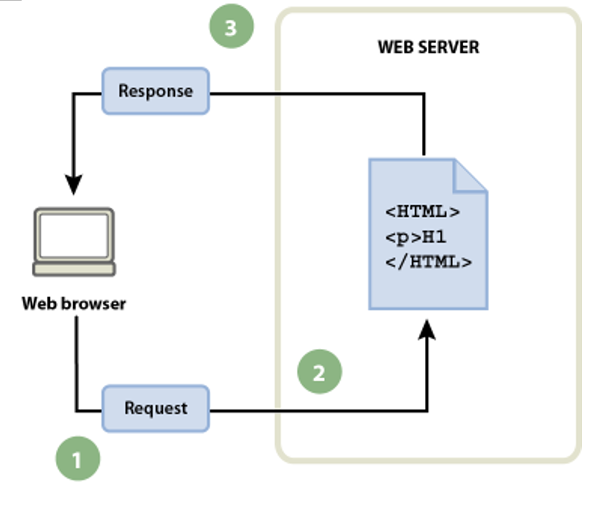
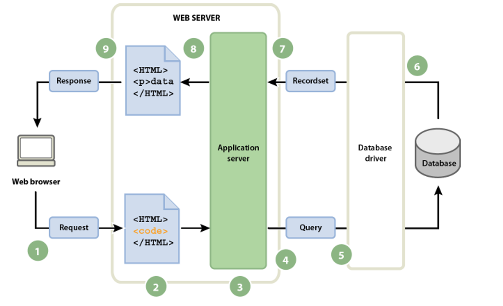

# HTML – Inleiding

Het doel van het vak *Webtechnologie* is om een applicatie te bouwen die is opgebouwd uit meerdere componenten. Deze componenten zorgen er samen voor dat de applicatie zijn werk naar behoren kan uitvoeren.

Een webapplicatie is een computerprogramma dat is uitgevoerd in de vorm van een interactieve website. Voordelen van dergelijke onlinesoftware zijn dat ze werken met een centrale database en gegevensopslag, dat de applicaties via het internet en een webbrowser overal te gebruiken zijn en dat deze programma’s relatief eenvoudig uit te breiden en door te ontwikkelen zijn.

Om de webapplicatie te kunnen gebruiken is alleen een browser en werkende internetverbinding noodzakelijk. Vaak moeten gebruikers eerst inloggen met een gebruikersnaam en wachtwoord om toegang te krijgen tot de applicatie. Webapplicaties kunnen sterk uiteenlopende doeleinden hebben. Een bekend soort webapplicatie is een contentmanagementsysteem (CMS), waarmee de inhoud van websites kan worden beheerd.

### Onderdelen van dit kwartaal

Het is de bedoeling ook tijdens dit kwartaal voor de fictieve muziekschool 'Sessions' een CMS-applicatie te bouwen. Voordat de applicatie in productie kan gaan, moeten nog wel de nodige stappen doorlopen worden en de nodige programma’s uitgelegd worden.

Hieronder een kort overzicht van de onderdelen die tijdens dit kwartaal aan bod zullen komen:

- Front-end development
    - HTML
    - CSS
    - Bootstrap
- Python
    - Herhaling
    - OOP
- Templates, formulieren en databases
- Flask
- Authenticatie
- Project

We zullen beginnen met een overzicht van de werking van een webpagina. Hoe is het mogelijk dat een gebruiker precies de juiste gegevens op het scherm krijgt, bij een verzoek om informatie? Vervolgens komen de programma’s aan bod die ervoor zorgen dat de inhoud op het scherm getoond kan worden.

## Hoe werkt een web-pagina?

Het web is eigenlijk niks anders dan een hele grote verzameling van allerlei soorten bestanden die door middel van *webservers* beschikbaar worden gesteld. Een webserver is een stuk software dat 'luistert' naar aanvragen van andere computers en op basis van zo'n aanvraag een bestand terugstuurt. Bekende webservers zijn [Apache](http://httpd.apache.org/), [ngnix](https://www.nginx.com/) of [Microsoft IIS](https://www.iis.net/).

Wanneer je een url in de locatiebalk van je browser intypt en op `Enter` drukt, wordt er een dergelijke aanvraag naar de server gestuurd die staat op die specifieke URL. Die server verwerkt de aanvraag en stuurt het bestand terug. Of, als het bestand niet gevonden kan worden, wordt er de code `404 Not Found` teruggestuurd.

!!! info "Reponse Codes"
    Die code is een zogenaamde [`HTTP Response Status Code`](https://developer.mozilla.org/nl/docs/Web/HTTP/Status). Later in deze module komen we hier nog uitgebreid op terug.

Dat wat je in je browser ziet en dat wat de server terugstuurt verschilt nogal van elkaar.De server stuurt in de regel platte tekst terug (bijvoorbeeld html, css of javascript, maar dat kan van alles zijn) en je browser zet deze platte tekst om in een totaal van fraai vormgegeven tekst, met plaatjes en interactiviteit (een proces dat bekend staat als [renderen](https://nl.wikipedia.org/wiki/Renderen)).

## Statische en dynamische webpagina's

### Statische pagina's

Webpagina's kun je onderverdelen in *statische* en *dynamische* pagina's. Een *statische webpagina* is een webpagina die niet verandert als een sitebezoeker de pagina opvraagt: de webserver verzendt de pagina ongewijzigd naar de webbrowser. De inhoud van een statische webpagina wordt bepaald door de paginaontwerper en verandert niet op het moment dat de pagina wordt opgevraagd.

1.	De webbrowser vraagt een statische pagina op.
2.	De webserver zoekt en vindt de pagina.
3.	De webserver verzendt de pagina naar de betreffende browser.

### Dynamische webpagina's
Als de webserver echter een verzoek voor een *dynamische* pagina ontvangt, reageert de server anders: de pagina wordt doorgegeven aan een speciaal stukje software dat voor de afhandeling van de pagina moet zorgen. Deze speciale software wordt een *toepassingsserver* genoemd. Deze server leest de code op de pagina, verwerkt de pagina volgens de instructies in de code en verwijdert de code vervolgens van de pagina.

Het resultaat is een statische pagina die de toepassingsserver weer teruggeeft aan de webserver, die de pagina op zijn beurt verzendt naar de browser waar de pagina in eerste instantie is opgevraagd. Als de pagina arriveert, ontvangt de browser alleen HTML.

1.	De webbrowser vraagt een dynamische pagina op.
2.	De server zoekt de pagina en geeft deze door aan de toepassingsserver
3.	De toepassingsserver scant de pagina op instructies en voltooit de pagina.
4.	De toepassingsserver retourneert de voltooide pagina aan de webserver.
5.	De webserver verzendt de voltooide pagina naar de betreffende browser.

Door middel van een toepassingsserver is het mogelijk bronnen aan de serverzijde te gebruiken, waaronder bijvoorbeeld een database. Een dynamische pagina kan de toepassingsserver de instructie geven om gegevens uit een database op te halen en deze in de HTML van de pagina in te voegen.

### Het gebruik van een database

Door het gebruik van een database voor het opslaan en terughalen van inhoud kan het *ontwerp* van de website gescheiden worden van de *inhoud* die op de site weergegeven wordt. De inhoud kan vervolgens geüpload worden naar een database en de inhoud vervolgens door de website laten ophalen als antwoord op een aanvraag.

De instructie om gegevens uit een database op te halen, wordt een *databasequery* genoemd. Zo'n query bestaat uit zoekcriteria die worden uitgedrukt in een databasetaal die SQL (Structured Query Language) wordt genoemd. De SQL-query wordt geschreven in scripts of tags op de server van de pagina.

Een toepassingsserver kan niet rechtstreeks met een database communiceren, omdat de typische indeling van de database de gegevens onleesbaar weergeeft (net zoals een Microsoft Word-document onleesbaar is wanneer het in Kladblok wordt geopend). De toepassingsserver kan uitsluitend met de database communiceren met behulp van een databasestuurprogramma: software die als een vertaler tussen de toepassingsserver en de database fungeert.

Nadat het stuurprogramma de communicatie tot stand heeft gebracht, wordt de query voor de database uitgevoerd en wordt een recordset gemaakt. Een recordset is een reeks gegevens die uit één of meer tabellen in een database zijn gehaald. De recordset wordt geretourneerd aan de toepassingsserver, die de gegevens gebruikt om de pagina te voltooien.

1.	De webbrowser vraagt een dynamische pagina op.
2.	De webserver zoekt de pagina en geeft deze door aan de toepassingsserver.
3.	De toepassingsserver scant de pagina op instructies.
4.	De toepassingsserver verzendt de query naar het databasestuurprogramma.
5.	Het stuurprogramma voert de query uit op de database.
6.	De recordset wordt als resultaat geretourneerd aan het stuurprogramma.
7.	Het stuurprogramma geeft de recordset door aan de toepassingsserver.
8.	De toepassingsserver voegt de gegevens in op de pagina en geeft de pagina door aan de webserver.
9.	De webserver verzendt de voltooide pagina naar de betreffende browser.

Bijna iedere database kan voor een webtoepassing gebruikt worden, zolang het juiste  databasestuurprogramma maar op de server geïnstalleerd is.

