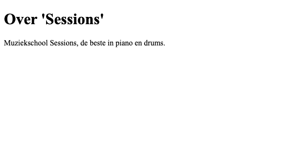
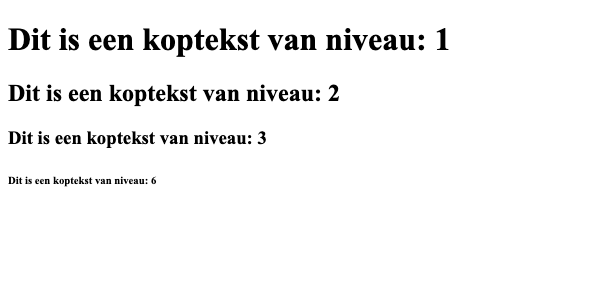
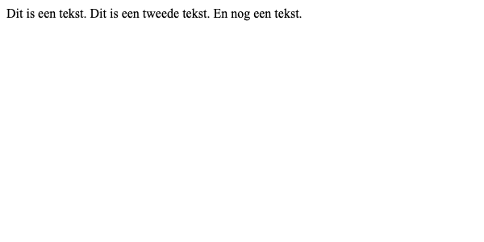
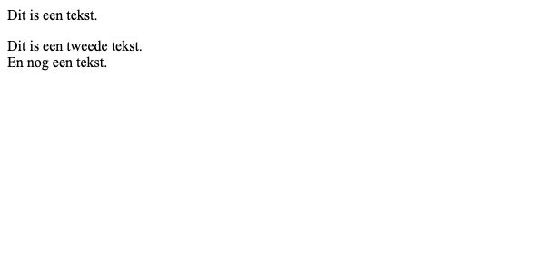
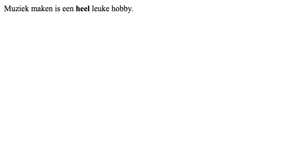

# HTML – tags

Omdat de server in principe platte tekst aan de browser teruggeeft, is er een structuur nodig om aan te geven wat de verschillende onderdelen uit die platte tekst betekenen. Een koptekst is immers iets anders dan een stuk broodtekst. Hiervoor gebruiken we HTML.

HTML staat voor *HyperText Markup Language*. Het is, zogezegd, de taal waarmee de inhoud van een website *gemarkeerd* kan worden zodat de browser 'begrijpt' wat aan de bezoeker getoond moet worden. Het geeft structuur aan een gewoon tekstbestand dat de browser anders niet zou begrijpen.

HTML is in het begin van de jaren negentig van de vorige eeuw ontwikkeld door [Tim Berners-Lee](https://nl.wikipedia.org/wiki/Tim_Berners-Lee), terwijl hij werkte bij [CERN in Zwitserland](https://home.cern/).


!!! info "HTML was niet nieuw"
    Hoewel Tim Berners-Lee (of TBL) HTML bedacht en ontwikkeld heeft, wat dat in die tijd niet nieuw. Het idee van het in de tekst zélf aangeven wat de verschillende onderdelen van die tekst betekenen (en eventueel hoe die moeten worden vormgegeven) stamt al uit de jaren zestig. Technieken als de [Generalized Markup Language (GML)](https://en.wikipedia.org/wiki/Standard_Generalized_Markup_Language#History) en [COCOA](https://en.wikipedia.org/wiki/COCOA_(digital_humanities)) gingen aan HTML vooraf.

    Het echt *nieuwe* van TBL was dat HTML een stuk eenvoudiger was om mee te werken, en dat de *browser* een stuk 'vergevingsgezinder' was dan de systemen die op die oudere technieken gebaseerd waren – een ontwerpbeslissing waar we ook heden ten dage nog last van hebben...

## Tags

Het is niet mogelijk zomaar een paragraaf tekst te typen en dan hopen dat de browser snapt dat het een paragraaf is. Voor de browser zijn paragrafen niets meer dan alleen maar een rij letters! De paragraaftekst moet in de HTML-opmaak staan. Daarvoor is het element `<p>` beschikbaar.

HTML is opgebouwd uit elementen (*tags*) die elk hun eigen betekenis hebben. Ieder element heeft een opening (het begin) en een sluiting (het einde). De inhoud van elk element staat tussen de opening- en sluitingstag. De open- en sluit tags voor elk element worden geschreven tussen haken (`<` en `>`). De sluitingstag kent ook een forwardslash (`/`). Binnen tags kun je weer andere tags introduceren, zodat je uiteindelijk een boomstructuur krijgt.

De algemene vorm van een element is dus als volgt:

```html
<tag>
    hier staat data
</tag>
```

!!! warning "Lege elementen"
    Een aantal elementen kan *geen* andere elementen bevatten (geen "vertakkingen" met andere elementen) en hebben om deze reden *geen* afsluitende tag. Bekende lege elementen zijn:

    - `<br>`
    - ``
    - `<input>`

    Met `<br>` (een nieuwe regel, of *line break*) zal je snel kennismaken, `` (voor het plaatsen van afbeeldingen) en  `<input>` (voor het verzamelen van input door de gebruiker in formulieren) zullen later volgen.
    Zie MDN voor een volledig overzicht van [lege elementen](https://developer.mozilla.org/en-US/docs/Glossary/Empty_element).

### Een voorbeeld

Hieronder staat een voorbeeld van een eenvoudige HTML-pagina. Dit voorbeeld laat de algemene structuur van een webpagina zien.

!!! Info "Download de bestanden"
    Alle voorbeelden die we in dit onderdeel laten zien, kun je [hier downloaden](../../bestanden/html.zip).

```html
<!DOCTYPE html>
<html>
    <head>
        <title>Muziekschool Sessions</title>
    </head>
    <body>
        <h1>Over ‘Sessions’</h1>
        <p>Muziekschool Sessions, de beste in piano en drums.</p>
    </body>
</html>
```

Wanneer je deze code opslaat en opent in een browser, krijg je het onderstaande resultaat te zien:





!!! info "Gebruik van het file system"
    Normaliter maken we gebruik van een webserver om bestanden in je browser te laten zien. In de eerste drie weken openen we de bestanden gewoon via het file system. Vanaf week 4, wanneer we met Flask gaan werken, zullen we daadwerkelijk met een (ontwikkel)server gaan werken.


De eerste regel `<!DOCTYPE html>`, oftewel *Document Type Definition* (DTD) is bedoeld om aan te geven door welke versie van HTML het document is opgebouwd.

Als tweede wordt de tag `<html>` ingezet om de browser te laten weten dat HTML-code wordt gebruikt. Zoals je ziet wordt deze tag aan het eind van de pagina weer afgesloten (met `</html>`).

De `<head>`-tag bevat de headerinformatie over de pagina. Hierin is bijna altijd de titel van de pagina en meta-tags opgenomen. In latere sessies zullen we aangeven wat er nog meer in de header terecht kan (en moet) komen.

De echte inhoud van elk HTML-document zit in de *body* (let op de corresponderende tag: `<body>`). Dit is waar de structuur van het document beschreven wordt.

Er is een groot aantal tags voorhanden (bekijk [de referentie op MDN voor een volledig overzicht](https://developer.mozilla.org/en-US/docs/Web/HTML/Element)) die gebruikt kunnen worden om onder meer plaatjes en/of hyperlinks toe te voegen. In de volgende paragraaf bespreken we eenn aantal basistags.

## Een paar belangrijke tags

HTML bestaat uit dus uit een serie elementen die gebruikt kunnen worden om de verschillende onderdelen van de inhoud te verpakken of te omhullen zodat die er op een bepaalde manier gaat uitzien of zich gedragen. De tags (een ander woord voor labels of markeerders) die de tekst insluiten kunnen van een woord of een afbeelding een hyperlink naar ergens anders maken, ze kunnen woorden cursiveren, lettertypes vergroten of verkleinen enzovoort. Neem bijvoorbeeld de volgende regel tekst:

```html
<body>
    Muziek maken is een leuke hobby.
</body>
```

Het is de bedoeling deze regel als paragraaf te gaan gebruiken. Dat kan geregeld worden door de tekst te omhullen met de volgende paragraaf labels (`<p>tekst</p>`):

```html
<body>
    <p>Muziek maken is een leuke hobby.</p>
</body>
```

### Koppen

Niet alle tags kunnen hier uitvoerig besproken worden (er zijn er te veel, en je kunt ze zelf ook maken), dus we richten ons hier op de meest gebruikte. Als eerste onderwerp worden de ‘HTML-koppen’ besproken. Met de elementen `h1` tot en met `h6` kan een titel (een *heading*) gegeven worden aan het document of een deel ervan. Daarvan is `h1` het hoogste niveau dat als eerste wordt gebruikt en `h6` het laagste niveau.

```html
<!DOCTYPE html>
<html>
    <head>
        <title>Headings</title>
    </head>
    <body>
        <h1>Dit is een koptekst van niveau: 1</h1>
        <h2>Dit is een koptekst van niveau: 2</h2>
        <h3>Dit is een koptekst van niveau: 3</h3>
        <h6>Dit is een koptekst van niveau: 6</h6>
    </body>
</html>
```



Koppen zijn belangrijke elementen op een pagina. Koppen trekken de attentie van de bezoekers van je site en ze geven structuur aan je pagina. Wanneer koppen niet aantrekkelijk of informatief zijn, zijn je lezers zo weer vertrokken naar een andere pagina of een website. Koppen worden ingezet om aandacht te trekken van de belangstellenden. Belangrijk is dat de koppen aanspreken zodat gebruikers blijven hangen en op zoek gaan naar meer informatie over het onderwerp van de site.

### blok-elementen

Ter vergelijk een opbouw van een HTML-pagina zonder opmaak (vanaf nu worden alleen de regels binnen de `body`-tag in het kader opgenomen).

```html
<body>
    Dit is een tekst.
    Dit is een tweede tekst.
    En nog een tekst.
</body>
```



De browser heeft er geen weet van dat het de bedoeling is geweest om de drie stukken tekst op de wijze te tonen zoals is vormgeven in het kader. Zonder opmaakelementen worden alle teksten dus na elkaar naar het scherm geschreven.

Het gewenste resultaat kan natuurlijk wel gecreëerd worden. Daarbij worden de elementen paragraaf `<p>` en line-break `<br>` gebruikt.

Het `<p>` element is één van de meest gebruikte bouwstenen in HTML. Deze tag definieert een alineascheiding in gewone tekst. Na deze tag creëert de browser automatisch wat ruimte boven en onder de inhoud. Deze ruimte wordt toegepast door de ingebouwde stylesheets van de browser.

Het `<br>` element (line break) begint een nieuwe regel. Dit element is nuttig wanneer de tekst op een bepaalde plaats afgebroken moet worden. Je kunt de `<br>` tag ook binnen een paragraaf gebruiken.

```html
<body>
    <p>Dit is een tekst.</p>
    Dit is een tweede tekst.<br>
    En nog een tekst.
</body>
```



Wat opvalt is dat de line-break geen begintag nodig heeft. Voor enkele HTML-elementen geldt dat ze correct kunnen worden weergegeven zelfs zonder beide tags op te voeren.

Het is ook mogelijk binnen tags andere tags in te voegen. Dit wordt *nesten* genoemd. In het voorbeeld hieronder gebruiken we bijvoorbeeld het element `<strong>` om duidelijk te maken dat muziek maken echt een heel leuke hobby is.

```html
<body>
    <p>Muziek maken is een <strong>heel</strong> leuke hobby.</p>
</body>
```



Belangrijk is wel dat de elementen op een juiste wijze genest worden: het element `<strong>` zal gesloten moeten zijn voordat het `<p>`-element wordt beëindigd. Wordt dat achterwege gelaten dan overlappen de elementen elkaar en zal de webbrowser een gok wagen wat er van hem gevraagd wordt, wat tot onverwachte resultaten kan leiden.


