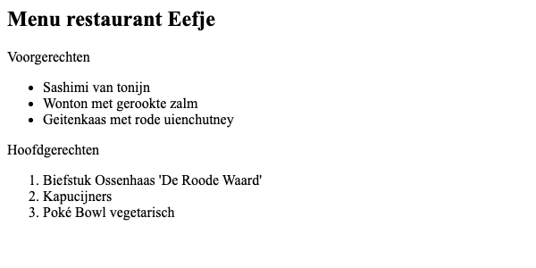
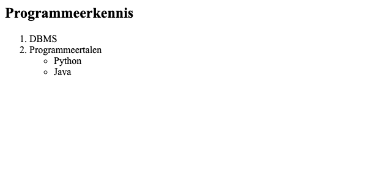
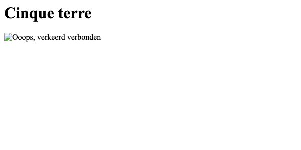
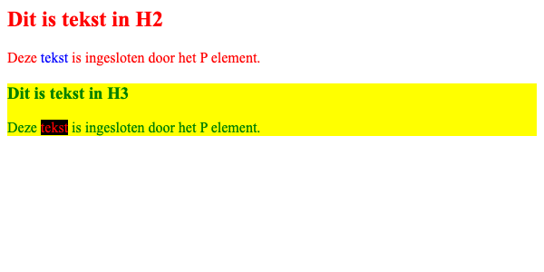
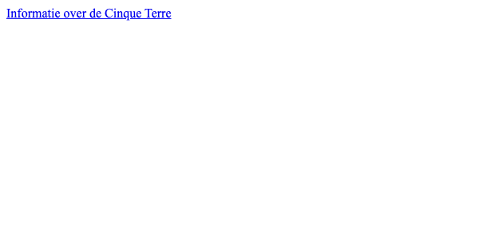
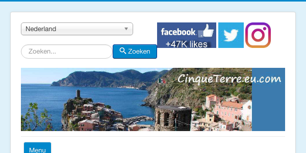

# HTML – Lists, Divs en Spans

Aan het eind van deze tekst maken we [oefening nummer 1](../oefeningen/wk1oefening1.md).

## List

Veel webinhoud bestaat uit lijsten en om die reden heeft HTML daar speciale elementen voor. De gebruikelijkste lijsttypes zijn *geordend* en *ongeordend* lijsten:

1. **Ongeordende lijsten** zijn lijsten waarbij de volgorde van de artikelen in de lijst er niet toe doet, zoals een boodschappenlijst. Deze worden ingesloten in een `<ul>`-element. Standaard worden de items voorafgegaan door een bullet.

2. **Geordende lijsten** zijn lijsten waarbij de volgorde van de artikelen of onderwerpen in de lijst er wel degelijk toe doet, zoals een recept. Deze worden ingesloten door een `<ol>`-element. Standaard worden de items binnen zo’n lijst voorafgegaan door een cijfer, maar je kunt ook andere vormen kiezen.

Elk element binnen een lijst wordt ingebed door middel van een `<li>`-tag (van *list item*).

```html
<body>
    <h2>Menu restaurant Eefje</h2>
    <p>Voorgerechten</p>
    <ul>
        <li>Sashimi van tonijn</li>
        <li>Wonton met gerookte zalm</li>
        <li>Geitenkaas met rode uienchutney</li>
    </ul>
    <p>Hoofdgerechten</p>
    <ol>
        <li>Biefstuk Ossenhaas ‘De Roode Waard’</li>
        <li>Kapucijners </li>
        <li>Poké Bowl vegetarisch</li>
    </ol>
</body>
```



Ook binnen een lijst kun je elementen nesten; je kunt dus ook een *list* in een *list* stoppen. Het kan daarbij handig zijn de nummering voor de geneste lijst afwijkend te maken. Geordende en ongeordende lijsten mogen daarbij ook door elkaar gebruikt worden.

```html
<body>
    <h2>Programmeerkennis</h2>
    <ol>
        <li>DBMS</li>
        <li>Programmeertalen</li>
        <ul>
            <li>Python</li>
            <li>Java</li>
        </ul>
    </ol>
</body>
```



## Attributen

Afbeeldingen zijn een belangrijk onderdeel van veel webpagina's. Om een afbeelding toe te voegen aan het HTML-document wordt de tag `` gebruikt.

```html

```

Met dit element kan een afbeelding in een HTML-pagina ingebed worden. Om aan te geven wáár het betreffende plaatje gevonden kan worden, moeten we een zogenaamd *attribuut* aan de tag toevoegen. Door gebruik te maken van attributen kun je html-tags voorzien van speciale betekenis, zoals bijvoorbeeld de locatie (url) van een plaatje.

De algemene vorm van een attribuut is `name="value"`. In het geval van onze ``-tag is de *name* van het attribuut `src` en de *value* van het attribuut de `url` van het plaatje. (`src `= source en source betekent bron). Dit attribuut bevat het pad naar het afbeeldingsbestand. Het pad kan leiden naar een folder op de eigen computer of zelfs naar een plaatje op het internet zelf.

Behalve de url van het plaatje voegen we in de regel ook nog een `alt`-attribuut toe (`alt` = alternative, alternatief in het Nederlands). Met dit attribuut kan een beschrijving aan de afbeelding gekoppeld worden voor het geval bezoekers zijn niet in staat de afbeelding te bekijken.

In [de folder waar verder alle html-voorbeelden bewaard zijn](../../bestanden/html.zip), zijn ook afbeeldingen ondergebracht, onder meer `venazza.jpeg`, wat aan een webpagina wordt toegevoegd. De totale html wordt dan als volgt:

```html
<body>
    <h1>Cinque terre</h1>
    
</body>
```


Het `alt`-attribuut is handig voor mensen met een visuele beperking: op deze manier weet de spraaksoftware wat er moet worden uitgesproken wanneer er een plaatje op de pagina voorkomt. Maar ook tijdens het ontwikkelen kan het handig zijn, om bijvoorbeeld eenvoudig te achterhalen of je de bestandsnaam van de afbeelding goed hebt.

```html
<body>
    <h1>Cinque terre</h1>
    
</body>
```



## Div en span

De elementen `<div>` en `<span>` gebruikt worden wanneer een stijl voor een deel van een document moet worden vastgelegd en dat deel niet tevens door een ander element ingesloten wordt.

De `<div>`-tag wordt vaak gebruikt om een stijl voor een groter deel van een document vast te leggen. Het geeft aan dat bepaalde elementen van je pagina bij elkaar horen (`div` staat ook voor [Content Division](https://developer.mozilla.org/en-US/docs/Web/HTML/Element/div)).

De `<span>`-tag lijkt erg op de `<div>`-tag, maar heeft als belangrijk verschil dat deze tag *inline* gebruikt kan worden. Waar een `<div>` normaliter gepaard gaat met een nieuwe regel ervoor en erna, kun je de `<span>`-tag gebruiken om onderdelen van de *lopende tekst* te stylen.

Zowel een `<div>` als een `<span>` hebben vanuit zichzelf geen speciale style. Dit krijgen ze pas wanneer je deze style definieert, bijvoorbeeld met behulp van *stylesheets*, wat we volgende week zullen gaan doen. Je kunt ook gebruik maken van het `style`-attribuut. Zie het voorbeeld hieronder.

```html
<body>
    <div style="color: red; background-color: white;">
        <h2>Dit is tekst in H2</h2>
        <p>Deze <span style="color: blue; background-color: white;">tekst</span> is ingesloten 	door het P element.</P>
    </div>
    <div style="color: green; background-color: yellow;">
        <h3>Dit is tekst in H3</h3>
        <p>Deze <span style="color: red; background-color: black;">tekst</span> is ingesloten 	door het P element.</P>
    </div>
</body>
```



!!! question "Een vreemd voorbeeld?"
    Het ziet er in eerste instantie misschien wat weird uit, deze kleurencombinatie, maar dit voorbeeld is bedoeld om aan te geven op welke wijze in de volgende paragrafen CSS en Bootstrap de opmaak van verschillende divisies op een webpagina invullen.

## De `Anchor`-tag

Het World Wide Web dankt zijn spinachtige naam aan de overvloedige verbindingen die websites met één muisklik met elkaar verbinden. Dit maakt internet zo bijzonder. Links zijn te vinden in bijna alle webpagina's. Gebruikers kunnen op links klikken en hun weg vinden van pagina naar pagina. Er kunnen links ingebouwd worden naar andere websites, maar ook naar een andere pagina binnen dezelfde website of zelfs naar een andere plek op dezelfde pagina. Links worden aangebracht de ankertags `<a>` en `</a>` en hun attributen.

```html
<a href="URL">Link tekst</a>
```

De bestemming van de link wordt gedefinieerd in het `href`-attribuut (van *hyperlink reference*) van de tag. Op de plaats van 'Link tekst' moet de tekst weergegeven worden waar de bezoeker op kan klikken om naar de betreffende pagina te gaan.

De pagina waar meer informatie te vinden is over de bijzondere vijf dorpen is bijvoorbeeld te vinden op het adres `https://www.cinqueterre.eu.com/nl/`. Ingevuld wordt dat dan:

```html
<body>
    <a href="https://www.cinqueterre.eu.com/nl/">Informatie over de Cinque Terre</a>
</body>
```



Wanneer de bezoeker dan op de tekst "Informatie over de Cinque Terre" klikt, wordt de browser doorgestuurd naar de pagina die te vinden is op de url die gegeven is in het `href`-attribuut van de link.



De link in het vorige voorbeeld is een zogenaamd *volledig pad*: er zit een volledige url achter de link. Je kunt ook gebruik maken van de locatie van het bestand waar de link zelf inzit, en het pad naar de gewenste pagina hier vanuit bepalen. Dat is een zogenaamd *relatief pad* (namelijk relatief ten opzichte van de huidige pagina).

```html
<!-- bestand pagina1.html -->
<body>
    Naar de <a href="pagina2.html">tweede</a> pagina
</body>
```

```html
<!-- bestand pagina2.html -->
<!-- dit zit in dezelfde directory als bestand pagina1.html -->
<body>
    Terug naar de <a href="1.html">eerste</a> pagina
</body>
```

!!! info "Commentaar in html"
    Net als in programmeertalen kun je ook in html commentaar opnemen. Je ziet dit in het voorbeeld hierboven gebeuren. Commentaar staat tussen `<!--` en `-->`. Dat kan handig zijn, wanneer je heel complexe of uitgebreide html aan het typen bent, of wannneer je een stuk html even niet in de browser wil zien.

Tenslotte kun je ook nog een link maken naar een element *binnen* dezelfde pagina. Kijk bijvoorbeeld eens in het menu van deze pagina. Hier zie je de inhoudsopgave staan; door op één van deze links te klikken, ga je direct naar het betreffende onderdeel op deze pagina zelf.

Als je met je muis over zo'n link heengaat, zie je hoe die link eruit ziet: er wordt gebruik gemaakt van een *hashtag* (`#`) gevolgd door een stukje tekst. Die tekst correspondeert dan weer met het `id`-attribuut van het element in kwestie. Daar komen we later op terug, wanneer we het gaan hebben over stylesheets.

Maak nu [oefening nummer 1](../oefeningen/wk1oefening1.md).