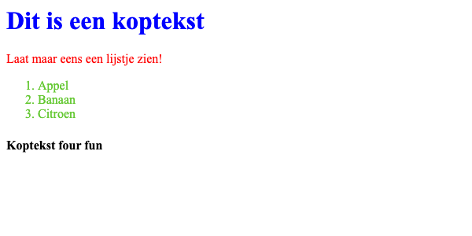
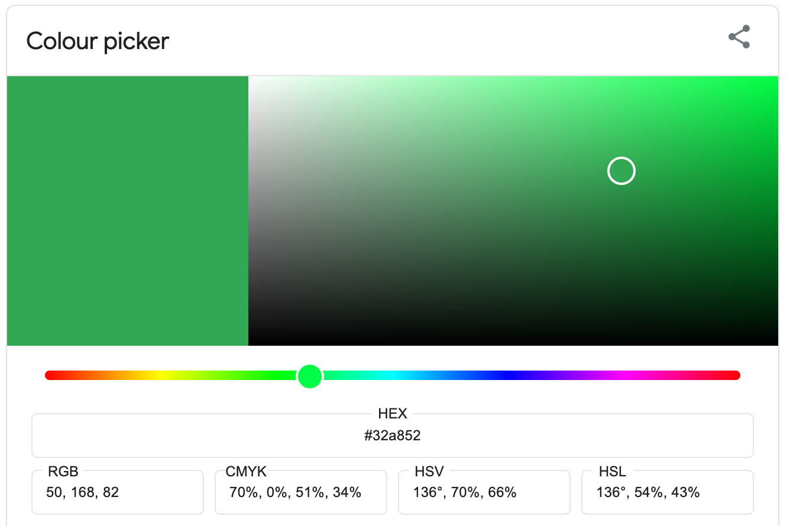

# CSS – Inleiding

Cascading Style Sheets (CSS) is de code die wordt gebruikt om webpagina’s van een stijl te voorzien. Net zoals HTML is CSS  niet echt een programmeertaal, maar het is ook niet echt een opmaaktaal zoals html. Je zou kunnnen zeggen dat het een *stijltaal* is: het stelt een ontwerper in staat om diverse stijlen en stijlvormen op geselecteerde elementen in een HTML-document toe te passen.

Hieronder zie je een stukje css. Deze code zorg ervoor dat de tekst van alle paragrafen (alles met het element `<p>`) *rood* wordt weergegeven. 

```
p {
  color: red;
}
```

!!! Info "Bestanden downloaden"
    Ook de bestanden die we hier bespreken kun je downloaden. Volg daarvoor [deze link](../../bestanden/css.zip).

Je kunt css in het html-bestand zelf schrijven, maar je kunt het ook in een separaat bestand opslaan. Die laatste methode is wel makkelijker, omdat je op die manier dezelfde *stylesheet* in verschillende hmlt-bestanden kunt gebruiken. Om ervoor te zorgen dat een html-bestand gebruik kan maken van een css-bestand, moet je een koppeling tussen deze twee aanbrengen. Dat doe je in de `header` van het html-bestand (dus tussen `<head>` en `</head>`).


```
<!DOCTYPE HTML>
<html> 
    <head> 
        <title>Test CSS</title> 
        <!-- met deze regel koppelen we de stylesheet aan deze html -->
        <link href="stijl.css" rel="stylesheet" type="text/css">
    </head> 
    <body>        
        <p>Muziek maken is een leuke hobby!</p>
        Meld je aan voor een passende cursus.
        <p>Vul het aanmeldingsformulier in!</p>
    </body> 
</html>
```


Alle tekst opgenomen binnen een paragraaf heeft daadwerkelijk een rode kleur gekregen.

!!! info "External, Internal en Inline"
    Je kunt de style van html op drie plekken neerzetten: *external*, *internal* of *inline*. Alles stijl die je definieert in een extern bestand (een ander bestand dan het html-bestand waar het betrekking op heeft) is *external*. Stijl die je definieert in het html-bestand zelf (tussen `<style>` en `</style` in de `header`) is *internal*. Verder kun je ook stijl aangeven in het `style`-attribuut van een html-tag: dit zijn zogenaamde *inline* styles.

    Waar je je css neerzet heeft repercussies voor hoe *sterk* de verschillende regels zijn. De *inline* styles zijn het sterkst, terwijl interne en externe stylesheets prioriteit krijgen op basis van welke het eerst door de browser zijn ingeladen. Dat betekent dat als een element door meerdere regels wordt gestyled, dat de inline-regels het altijd winnen.

## De anatomie van css-regels

Voordat er dieper op de materie wordt ingegaan aandacht voor de anatomie van een set CSS-regels. 


Je ziet hier een *selector*. Dat is het stuk css dat aangeeft welk html-element door de daaropvolgende regels moet worden vormgegeven. De selector is hier `p`, wat betekent dat *alle* `<p>`-tags in de corresponderende html worden vormgegeven op basis van de *style rules* die hier zijn gedefinieerd.

Selectors *matchen* bepaalde elementen uit het html-document. Dit matchen kan gebeuren op basis van het *type* van het element (zoals `p`), of op de waarde van een attribuut, of op de positie van het element in het hele document. Later komen we hier nog uitgebreid op terug.

Een *style rule*, of *stijlregel*, bestaat uit een *attribute* met een bijhorende *value*. Hier geven we aan dat de `color` de waarde `red` moet krijgen. Het attribuut `color` heeft betrekking op de *tekstkleur*, niet op de kleur van het element zelf.

De syntax van een CSS-file kent nog een paar belangrijke items:

- Elke regelset (behalve de selector) moeten worden ingesloten tussen accolades (`{` en `}`).
- Binnen elke stijldeclaratie , moet een dubbele punt genoteerd worden (`:`) om de eigenschap van zijn stijlwaarden te scheiden.
- Binnen elke regelset, moet een puntkomma (`;`) gehanteerd worden om iedere stijldeclaratie van zijn opvolger te scheiden.

In het voorbeeld kregen teksten van alle paragrafen een rode kleur. Er zijn meerdere manieren om kleur aan stijlelementen mee te geven.

```
 <h1>Dit is een koptekst</h1>

 <p>Laat maar eens een lijstje zien!</p>
 <ol>
   <li>Appel</li>
   <li>Banaan</li>
   <li>Citroen</li>
 </ol>

 <h4>Koptekst four fun</h4> 
```

```
p {
    color:red;
}

h1{
  color: blue;
}

li {
  color: rgb(100,200,50);
}
```


!!! info "Single line of multiline"
    Zoals veel onderwerpen in de software engineering bestaat er een uitgebreide discussie over de vraag of de css-regels onder elkaar (*multiline*) of achter elkaar (*single line*) moet zetten – zie [deze link](https://www.newmediacampaigns.com/page/single-line-vs-multi-line-css-a-tool-to-end-the-debate) (en de daar genoemde verdere links) voor een fraai overzicht van deze discussie. Voor beide manieren is iets te zeggen. Ons advies zou zijn om je hier een eigen mening over te vormen en je daaraan te houden. 

Er zijn *heel veel* (letterlijk honderden) attributen die je door middel van css kunt styleren. Bekijk [de uitgebreide documentatie op MDN](https://developer.mozilla.org/en-US/docs/Web/CSS/Reference) om hier een beeld van te krijgen.  

## Kleuren

Zoals je ziet kun je in css gewoon de naam van een kleur opgeven. Dit betreft zogenaamde *color keywords*: min of meer arbitraire namen van bepaalde kleuren. Een volledig overzicht is (opnieuw) [te vinden op MDN](https://developer.mozilla.org/en-US/docs/Web/CSS/color_value#Color_keywords).

De tweede manier van kleurtoewijzing, die je in het voorbeeld hierboven bij `li` ziet toegepast, is met de `rgb()`-methode. Door aan virtuele knoppen te draaien kunnen de waarden voor rood (r), groen (g) en blauw (b) aangepast worden, net zo lang tot de gewenste kleur gevonden is.

Als het lastig is om een geschikte kleur te vinden kan Google uitkomst brengen. Door de zoekterm “hex color” in te geven, wordt een tool geopend waar de gewenste kleur gekozen en gekopieerd kan worden naar de CSS-file. 



Zoals je hier ziet, kun je die `rgb()`-waarde ook weer in een hexadecimale notatie weergeven (weet je nog hoe dat zat? We hebben het er in thema 1.1 uitgebreid over gehad). In dat geval laat je de waarde vooraf gaan door een hashtag (`#`).

```
p{
  color: #eba134;
}
```

De `rgb()`-methode kent nog een variant, `rgba()`. De letter `a` staat voor alpha en bepaalt de *transparantie* van de opvulling. Alphawaarde 0 (nul) is volkomen transparant, alphawaarde 1 is volledig opaak.


