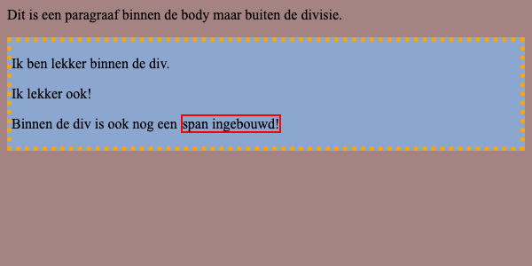
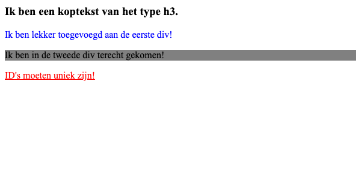

# CSS – selectors en matching-rules

Aan het eind van deze tekst maken we [oefening nummer 3](../oefeningen/wk1oefening3.md)

## Een hiërarchie van matching

Effecten die van toepassing zijn op de coderegels in een html-document kunnen op meerdere niveaus ingesteld worden. Het hoogste niveau is het element `<body>`. Stijldeclaraties die aan deze selector worden gegeven, zijn van toepassing op het gehele document. De impact van deze effecten kan echter 'overruled' worden door bepaalde onderdelen van het document andere eigenschappen toe te kennen. Deze instellingen krijgen de overhand ten opzichte van de stijlwaarden uit de selector `body`.

```
<body>
    <p>Dit is een paragraaf binnen de body maar buiten de divisie.</p>

    <div>
      <p>Ik ben lekker binnen de div.</p>
      <p>Ik lekker ook!</p>
      <p>Binnen de div is ook nog een <span>span ingebouwd!</span></p>
    </div>
</body>
```

```
body {  
    /* Een beetje leverkleurige achtergrond voor onze mooie html-pagina */
    background: #a68383;
}

div {
  background: #8ca7cf;
  /* Behalve de achtergrond geven we ook wat stijl aan de randen van deze div */
  border: orange;
  border-width: thick;  /*10 px */
  border-style: dotted;
}

span {
    /* je kunt de eigenschappen voor de border ook allemaal in één keer stijlen */
    border:solid red 2px;
}
```

We geven hier eerst een achtergrondkleur aan de `body`. Maar binnen de body hebben we een `div`, die weer zijn eigen stijl meekrijgt. Tenslotte zie je in deze `div` ook nog een `span`-tag staan, die ook weer eigen stijling heeft. Het eindresultaat van dit alles is dan als volgt:



## class en id

Stijlregels toekennen aan elementtypes (dus door middel van het beschrijven van de stijl van een `tag`) is een prima oplossing. Maar het nadeel is dat ze van toepassing zijn op *alle* elementen van het elementtype. Wat nu wanneer een stijlregel niet op alle elementen van een elementtype van toepassing is, maar op het ene element wel en op het andere niet? Daarvoor dienen de `class` selectors.

Bekijk het volgende stukje html:

```
<body>
    <h3>Ik ben een koptekst van het type h3.</h3>

    <div class="eerste-div">
      <p>Ik ben lekker toegevoegd aan de eerste div!</p>
    </div>

    <div class="tweede-div">
      <p>Ik ben in de tweede div terecht gekomen!</p>
    </div>

    <p id="apart">ID's moeten uniek zijn!</p>
</body>
```

Let op de attributen `class` bij beide `divs` en het attribuut `id` bij de onderste `p`. De element-selectors matchen standaard alleen standaard html-elementen (`tag`). Met een class selector kan specifieker te werk gegaan worden. Een class selectors richt zich op alle elementen met dezelfde waarde voor het `class` attribuut.

Elk html-element kan ingesteld worden door de inhoud van een class of van een id. In het css-document worden dan de stijldeclaraties voor de `class` of `id` bepaald. Er is een specifieke syntax voor beschikbaar.


- `.` (punt) matcht op de *waarde* van het `class`-attribuut
- `#` (hashtag) matcht op de *waarde* van het `id`-attribuut

Het grote verschil tussen beide is dat een ID een uniek onderdeel op een webpagina is. Een ID kan dus maar één keer voorkomen in de code van een website. De class selector mag vaker gebruikt worden in een html-document.

Uit het html-document uit het bovenstaande voorbeeld valt af te lezen er twee `<div>`-elementen in de coderegels zijn opgenomen. Het is de bedoeling om beide een andere look mee te geven. Hiervoor gebruiken we dus twee verschillende waarden voor de `class`. De laatste paragraaf willen we ook weer anders stylen, maar deze matchen we op het `id`. De stylesheet wordt dan als volgt:

```
.eerste-div{
  color: blue;
}

.tweede-div{
  background-color: gray;
}

#apart{
  color: red;
  text-decoration: underline;
}
```

Wat het volgende resultaat tot gevolg heeft:



Maak nu [oefening nummer 3](../oefeningen/wk1oefening3.md)

  


