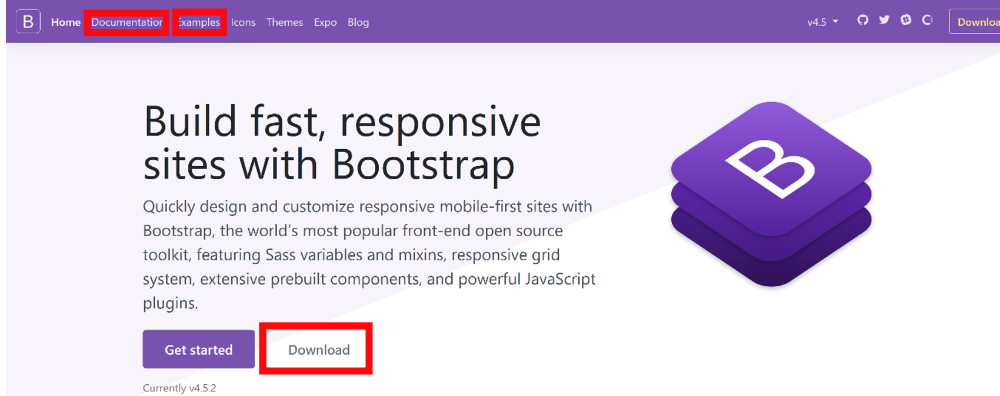
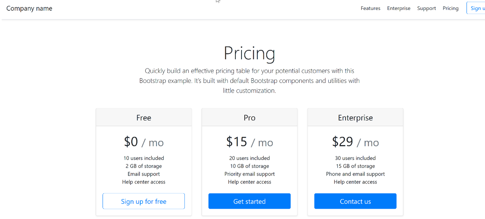

# Bootstrap – Inleiding

Bootstrap is een gratis front-end framework voor snellere en eenvoudigere webontwikkeling. Het bevat op html en css gebaseerde ontwerpsjablonen voor typografie, formulieren, knoppen, tabellen, navigatie, afbeeldingscarrousels en vele andere, evenals optionele Javascript-plug-ins. Tevens geeft het een gebruiker de mogelijkheid om eenvoudig responsieve ontwerpen te maken.

## Voordelen

Voordelen van Bootstrap:

- Eenvoudig in gebruik: iedereen met alleen basiskennis van HTML en CSS kan Bootstrap gaan gebruiken.
- Responsieve functies: de responsieve CSS van Bootstrap past zich aan telefoons, tablets en desktops.
- Mobiel-eerst benadering: in Bootstrap maken de mobile-first-stijlen deel uit van het kernraamwerk.
- Compatibiliteit met browsers: Bootstrap 4 is compatibel met alle moderne browsers.

 
Er zijn twee manieren om Bootstrap 4 te gebruiken voor een eigen website. 

1.	Maak gebruik van een CDN.
2.	Downloaden van Bootstrap 4.

!!! info "Content Delivery Network"
    Een *Content Delivery Network* (CDN) is een netwerk dat verspreid is over verschillende geografische locaties. Via dit netwerk wordt verschillende inhoud (*content*) aangeboden. Die content kan van alles zijn: video, plaatjes, maar dus ook css of programmacode. 
    
    Het voordeel hiervan is dat de *uptime* van zo'n netwerk vele malen hoger ligt dan een enkele computer. 

Open de pagina [GetBootstrap.com](https://getbootstrap.com/). Een klik op de button met de tekst ‘Download’ zorgt ervoor dat de complete software gedownload wordt. Wanneer er een stukje naar beneden gescrold wordt, zie je wat je moet doen om gebruik te maken van een CDN.

Als je gebruik wilt maken van een CDN, moet je de beide regels aan de rechterkant van het scherm opnemen in je html-document. In het beginscherm zijn een tweetal buttons rood omkaderd. Het kan erg nuttig zijn, zeker voor gebruikers die nog niet heel bedreven zijn in het werken met dit pakket, de onderliggende documentatie te bestuderen.

## Buttons

Als voorbeeld een overzicht van de component ‘Buttons’. Een keurige beschrijving, voorbeelden plus de bijbehorende code, klaar voor gebruik. Dat is voor elk van de items in het linker-menu prachtig uitgewerkt.

 

### Examples

Onder de knop *Buttons* zitten tal van schermontwerpen verborgen, variërend van een scherm dat de inhoud van een check-out formulier levert, inclusief controle op de juistheid van het invullen van de data tot een carrousel – een item dat verschillende afbeeldingen na elkaar kan tonen. Van elk voorbeeld kan de code bekeken worden.

Hieronder nog eeen voorbeeld van een schermontwerp gemaakt met Bootstrap dat bedoeld is om gebruikers te laten kiezen uit een drietal opties. 

Er is, kortom, heel veel mogelijk met Bootstrap. Bestudeer de voorbeelden en de achterliggende HTML en CSS om een beeld te krijgen van hoe één en ander in z'n werk gaat.

