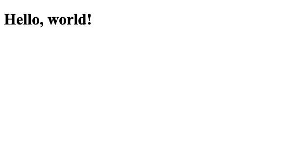
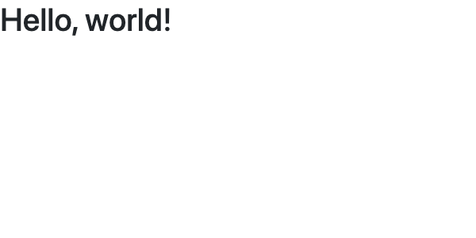
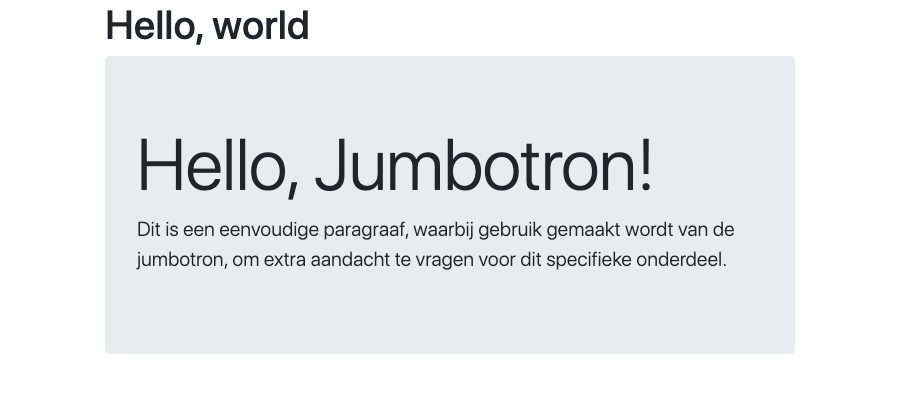
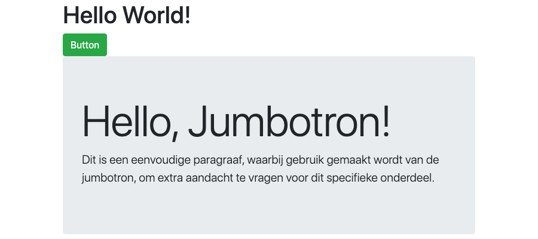
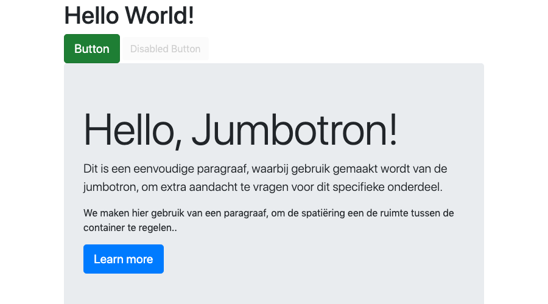

# Bootstrap – Voorbeeld

Als voorbeeld zullen we nu aan de hand van de documentatie een webpagina opbouwen. De basiscode kan aan het html-document worden toegevoegd en daar aangepast worden aan het gewenste ontwerp. Hierbij wordt een stapsgewijze opbouw gehanteerd.

!!! Info "Download de bestanden"
    De bestanden die in dit voorbeeld worden besproken zijn [via deze link te downloaden](../../bestanden/bootstrap.zip).

__Stap 1:__ html-document zonder koppeling naar Bootstrap.

```html
<!DOCTYPE html>
<html lang="en">
    <head>
        <title>Zonder</title>
    </head>
    <body>

        <h1>Hello, world!</h1>

    </body>
</html>
```



__Stap 2:__ Toevoegen links van Bootstrap.

Ieder html-document dat gebruik wil maken van de faciliteiten die door Bootstrap aangeboden worden, dient de benodigde links in de `<head>`-sectie op te nemen. Deze links kunnen gekopieerd worden van de site https://getbootstrap.com/, zoals hierboven al beschreven is.

```html
<!DOCTYPE html>
<html lang="en">
    <head>
        <title>Met</title>
        <meta charset="utf-8">
        <meta name="viewport" content="width=device-width, initial-scale=1, shrink-to-fit=no">
        <meta http-equiv="x-ua-compatible" content="ie=edge">

        <link rel="stylesheet" href="https://stackpath.bootstrapcdn.com/bootstrap/4.1.1/css/bootstrap.min.css" integrity="sha384-WskhaSGFgHYWDcbwN70/dfYBj47jz9qbsMId/iRN3ewGhXQFZCSftd1LZCfmhktB" crossorigin="anonymous">
        <script src="https://code.jquery.com/jquery-3.3.1.slim.min.js" integrity="sha384-q8i/X+965DzO0rT7abK41JStQIAqVgRVzpbzo5smXKp4YfRvH+8abtTE1Pi6jizo" crossorigin="anonymous"></script>
        <script src="https://cdnjs.cloudflare.com/ajax/libs/popper.js/1.14.3/umd/popper.min.js" integrity="sha384-ZMP7rVo3mIykV+2+9J3UJ46jBk0WLaUAdn689aCwoqbBJiSnjAK/l8WvCWPIPm49" crossorigin="anonymous"></script>
        <script src="https://stackpath.bootstrapcdn.com/bootstrap/4.1.1/js/bootstrap.min.js" integrity="sha384-smHYKdLADwkXOn1EmN1qk/HfnUcbVRZyYmZ4qpPea6sjB/pTJ0euyQp0Mk8ck+5T" crossorigin="anonymous"></script>
    </head>
    <body>

        <h1>Hello, world!</h1>

    </body>
</html>
```

Nog een geluk dat de links gekopieerd kunnen worden.



Een duidelijk verschil. De marges en het lettertype is aangepast door de Bootstrap-instellingen.

!!! info "width en init-scale"
    Bootstrap 4 is ontworpen om te kunnen werken met mobiele apparaten. Daarvoor is een `<meta>`-tag toegevoegd. Hier geven we twee waarden aan mee. Door te stellen dat `width = device-width` wordt de breedte van de pagina hetzelfde als de schermbreedte van het apparaat (dit is afhankelijk van het apparaat); `initial-scale = 1` stelt het initiële zoomniveau in, wanneer de pagina voor het eerst wordt geladen door de browser.

__Stap3:__ Container toevoegen.

Bootstrap vereist een omvattend element om de inhoud van de site in te pakken. Hiervoor maken we een `div` aan van de classe `container` (we laten voor de overzichtelijkheid nu even al die links in de `header` weg):

```html
<body>
    <div class="container">
        <h1>Hello World!</h1>
    </div>
</body>
```


__Stap 4:__ Jumbotron.

Een jumbotron zorgt voor een groot grijs vak, om speciale inhoud of informatie te accentueren. In een jumbotron kan nagenoeg elke geldige html geplaatst worden, inclusief andere Bootstrap-elementen of -klassen.

Om een jumbotron aan te maken, is een `<div>`-element nodig met klasse `jumbotron`.

```html
<body>
    <div class="container">
        <h1>Hello, world</h1>

        <div class="jumbotron">
            <h1 class="display-3">Hello, Jumbotron!</h1>

            <p class="lead">Dit is een eenvoudige paragraaf, waarbij gebruik gemaakt wordt van de jumbotron, om extra aandacht te vragen voor dit specifieke onderdeel.</p>
        </div>
    </div>
</body>
```



__Stap 5:__ Knoppen toevoegen.

Bootstrap kent ook verschillende typen knoppen. Eén van de voordelen hiervan, is dat door het algemene gebruik van Bootstrap de meeste mensen bekend zijn met de betekenis van de specifieke vorm van de knoppen, en de interactie met je site dus soepeler gaat lopen.

We gaan nu ook knoppen aan ons voorbeeld toevoegen. Als je de component *Buttons* [op de site van Bootstrap](https://getbootstrap.com/docs/5.0/components/buttons/) selecteert, krijg je te zien welke buttons er allemaal bestaan. Zie het voorbeeld hieronder (om het geheel overzichtelijk te houden wordt de container met de jumbotron onzichtbaar gemaakt).

```html
<div class="container">
    <h1>Hello World!</h1>

    <button class="btn btn-success" type="button" name="button">Button</button>

    <!-- rest van de html is weggelaten -->

</div>
```



Met de beschikbare informatie wordt een nog een tweede knop in de container opgenomen met de kenmerken, extra groot en niet actief (let op de waarden van het 'class`-attribuut):

```html
<div class="container">
    <h1>Hello World!</h1>

    <button class="btn btn-success" type="button" name="button">Button</button>
    <button type="button" class="btn btn-lg btn-primary" disabled>Primary button</button>

    <!-- rest van de html is weggelaten -->

</div>
```


Deze laatst toegevoegde knop heeft inderdaad de status inactief gekregen. Als je met je muis over deze knop gaat (*hover*), verschijnt er geen handje.

__Stap 6:__ Finishing touch.

In de html hieronder hebben we nog een paar wijzigingen aan onze geweldige site toegevoegd. De grotere knop heeft een ander uiterlijk gekregen, de tweede container heeft ook een tweede klasse gekregen, waarin een knop is opgenomen waaraan een link gekoppeld is.

```html
<body>
    <div class="container">
        <h1>Hello World!</h1>

        <button class="btn btn-success btn-lg active" type="button"       name="button">Button</button>
        <button class="btn " disabled type="button" name="button">Disabled Button</button>

        <div class="jumbotron">
            <h1 class="display-3">Hello, Jumbotron!</h1>

            <p class="lead">Dit is een eenvoudige paragraaf, waarbij gebruik gemaakt wordt van de jumbotron, om extra aandacht te vragen voor dit specifieke onderdeel.</p>

            <p>We maken hier gebruik van een paragraaf, om de spatiëring een de ruimte tussen de container te regelen..</p>

            <p class="lead">
                <a class="btn btn-primary btn-lg " href="#" role="button">Learn more</a>
            </p>
        </div>
    </div>
</body>
```




