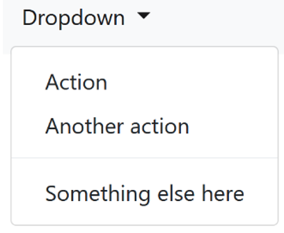

# Bootstrap – Navigatiebalk

Een navigatiebalk is een navigatieheader die bovenaan de pagina wordt geplaatst. Met Bootstrap kan een navigatiebalk worden uitgebreid of samengevouwen, afhankelijk van de schermgrootte.

Een standaard navigatiebalk wordt gemaakt met de `.navbar-klasse`, gevolgd door een responsive  samenvouwklasse: `.navbar-expand-xl`. Om hiervan en van keuzelijsten gebruik van te kunnen maken is de javascript-library jQuery nodig in combinatie met Bootstrap. We komen later nog uitgebreider terug op JavaScript; voor nu volstaat het te weten dat dit een programmeertaal die in de web-browser draait. Hiermee kun je functionaliteit en logica toevoegen aan je website.

Ga eventueel naar [de site van jQuery](https://code.jquery.com/) om een beeld te krijgen van hoe één en ander werkt. Om gebruik te kunnen maken van deze library, moet je de volgende regels toevoegen aan de `head`-sectie van je html-document:

```
<script
  src="http://code.jquery.com/jquery-3.1.1.js"
  integrity="sha256-16cdPddA6VdVInumRGo6IbivbERE8p7CQR3HzTBuELA="
  crossorigin="anonymous"></script>  
```

Hiermee is de voorbereiding geslaagd; over naar de navigatie. 

## Navigatie toevoegen

Om een navigatiebalk toe te kunnen voegen worden er op de Bootstrap-site onder het kopje Components twee mogelijkheden aangeboden: [`Nav`](https://getbootstrap.com/docs/5.0/components/navs-tabs/) en [`Navbar`](https://getbootstrap.com/docs/5.0/components/navbar/). Onder `Nav` worden alle opties beschreven, aanlijning, wel of geen tabs, achtergrondkleur en nog veel meer. Uiteraard kan de corresponderende code weer overgezet worden naar de webpagina om daar aan de wensen aangepast te worden.

Hier wordt gekozen voor de `Navbar`, waarom zal zo duidelijk worden. Navigatiebalken worden geleverd met ingebouwde ondersteuning voor een handvol sub componenten. 

Component-classe  |  Uitleg
------------------|------------
`.navbar-brand`	| Voor bedrijfs-, product, of projectnaam (mist bij Nav).
`.navbar-nav`	| Navigatiebalk zoals hieronder te zien is.
`.navbar-toggler`	| Nodig voor responsive, maakt inhoud zichtbaar op meerdere schermgrootten.
`.form-inline`	| Voor toevoegen formuliervelden
`.navbar-text`	| Voor het toevoegen van verticaal gecentreerde tekstreeksen.
`.collapse.navbar-collapse`	| Voor het groeperen en verbergen van de inhoud van de navigatiebalk door een bovenliggend breekpunt.

Als voorbeeld nu een responsieve navigatiebalk die alle bovengenoemde elementen bevat. Let op: we tonen *alleen* de `body`; jQuery en Bootstrap is al in de `head` ingeladen.

```
<body>
	<nav class="navbar navbar-expand-lg navbar-light bg-light">
        <a class="navbar-brand" href="#">BRAND</a>

        <button class="navbar-toggler" type="button" data-toggle="collapse" data-	target="#navbarSupportedContent" aria-controls="navbarSupportedContent" aria-	expanded="false" aria-label="Toggle navigation">	
        </button>

   <div class="collapse navbar-collapse" id="navbarSupportedContent">
   	<ul class="navbar-nav mr-auto">
   		<li class="nav-item active">
        	<a class="nav-link" href="#">SomeLink</a>
     	</li>      
      	<li class="nav-item">
        	<a class="nav-link" href="#">AnotherLink</a>
      	</li>
	    <li class="nav-item dropdown">
	        <a class="nav-link dropdown-toggle" href="#" id="navbarDropdown" 			      role="button" data-toggle="dropdown" aria-haspopup="true" 
		       aria-expanded="false">Dropdown</a> 
	        <div class="dropdown-menu" aria-labelledby="navbarDropdown">
          	    <a class="dropdown-item" href="#">Action</a>
          	    <a class="dropdown-item" href="#">Another action</a>
            </div>

	        <div class="dropdown-divider"></div>
                <a class="dropdown-item" href="#">Something else here</a>
        	</div>
        </li>
    </ul>

    <form class="form-inline my-2 my-lg-0">
    	  <input class="form-control mr-sm-2" type="search" placeholder="Search" 
	      aria-label="Search">
      	<button class="btn btn-outline-success my-2 my-sm-0" type="submit"> 	Search</button>
    </form>
  </div>
</nav>
</body>
```

Als deze code in de browser wordt geladen, wordt de volgende navigatiebalk zichtbaar, inclusief merknaam, keuzelijst en zoekmogelijkheid:


## Voordelen van `Navbar`
Een keuze voor `Navbar` kent een tweetal voordelen:

1.	Het logo van het bedrijf of product wordt getoond als BRAND.
2.	Als het scherm verkleind wordt blijft in ieder geval het woord BRAND zichtbaar.

Dat tweede punt vraagt misschien om toelichting. Als de schermgrootte te klein is om de inhoud van de webpagina te tonen, zorgt de `<div>` met de klassen `collapse navbar-collapse` ervoor dat het linker scherm in zicht is. Door een klik op de ‘hamburger’ verschijnt de navigatiebalk, nu verticaal opgebouwd. 

```
<div class="collapse navbar-collapse" id="navbarSupportedContent">
```


Dat er nog wat op het scherm te zien is komt doordat de volgende snippet buiten de `<div>` gehouden is en ook niet verdwijnt bij het collapsen. 

```
<button class="navbar-toggler" 
	type="button" data-toggle="collapse" 
	data-target="#navbarSupportedContent" 
	aria-controls="navbarSupportedContent" 
	aria-expanded="false" 
    aria-label="Toggle navigation">         

	<span class="navbar-toggler-icon"></span>
</button>
```

## Extra link

Het is natuurlijk ook mogelijk de navigatiebalk uit te breiden met een extra link. Het kan een link zijn of een drop down-menu; het gaat op vergelijkbare wijze. Als demo wordt een ‘NewLink’ aan de navigatie toegevoegd:

```
<li class="nav-item active">
        <a class="nav-link" href="#">Sessions</a>
</li>
```


In de code die Bootstrap ons ter beschikking heeft gesteld is ook een drop down-menu opgenomen. Na opening staat deze inhoud op het scherm.



Het is mogelijk meerdere divisies aan te brengen in een keuzemenu. De klasse `.dropdown-divider` helpt daarbij.

```
<a class="dropdown-item" href="#">Another action</a>
<div class="dropdown-divider"></div>
<a class="dropdown-item" href="#">Something else here</a>
```

Tot zover alle basisvaardigheden voor Bootstrap. Het is niet nodig zelf alle acties en instellingen uit het hoofd te leren. Het is veel belangrijker te oefenen de juiste componenten te selecteren, daarbinnen de juiste attributen op te zoeken en de bijbehorende code te implementeren in de webpagina om vervolgens nog de nodige aanpassingen door te voeren.


