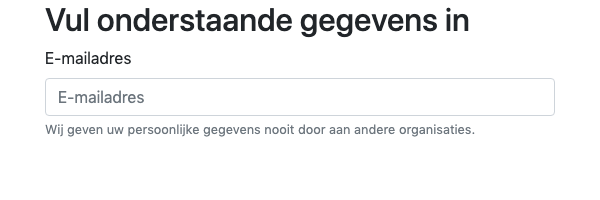
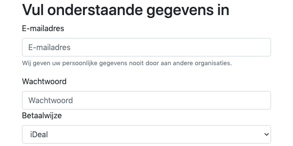
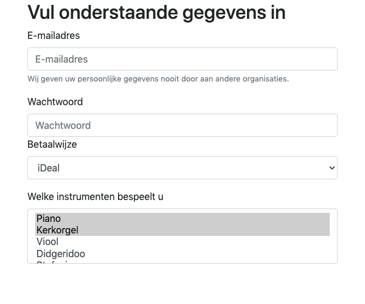
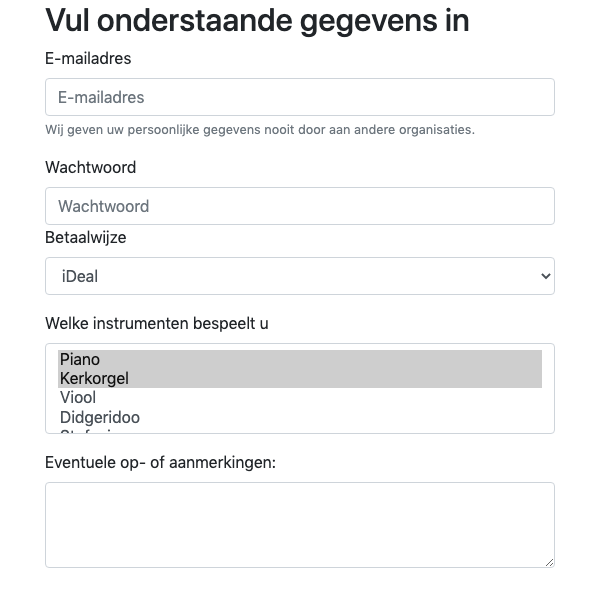
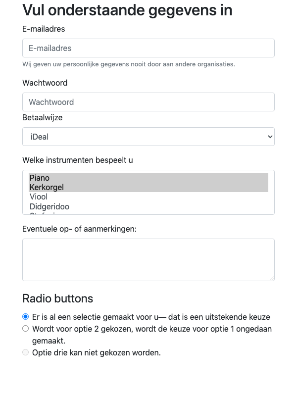
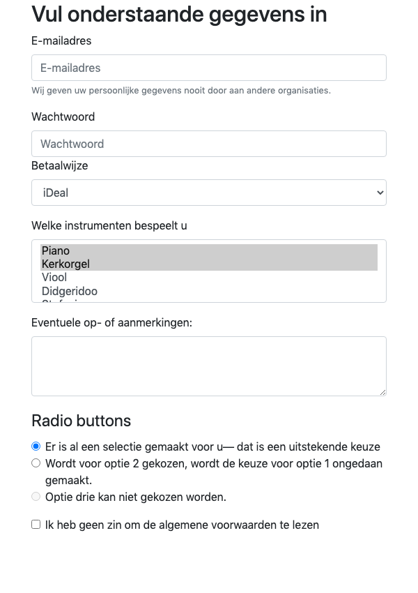
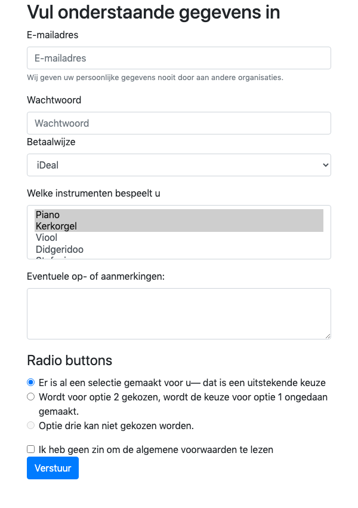

# Bootstrap – Formulieren

Eén van de meest gebruikte onderwerpen bij het ontwikkelen van een webapplicatie is het werken met formulieren. Basis hiervoor is html-code, aangevuld met de Bootstrap-links. De `<input>`-tag wordt veelvuldig gebruikt, in meerdere variaties en in combinatie met de klassen van Bootstrap.

Aan de hand van een kant-en-klaar formulier wordt de onderliggende code besproken. De volledige code kan weer in de documentatie gevonden worden. Uiteraard worden de items op het formulier opgenomen in het html-document tussen de tags `<form>` en `</form>`. Bovendien wordt het gehele formulier in een container ingebed. Dat alles levert de volgende basis op:

```
<body>
    <div class="container">
      <h2>Vul onderstaande gegevens in </h2>
      <form>
      </form>
    </div>
</body>
```

### Email-adres

```
<div class="form-group">
  <label for="e-mail">E-mailadres</label>
  <input type="email" class="form-control" id="e-mail" aria-	describedby="emailHelp" 	placeholder="E-mailadres">
  <small id="emailHelp" class="form-text text-muted">
     Wij geven uw persoonlijke gegevens nooit door 
     aan andere organisaties.
  </small>
</div>
```

Het meeste uit het bovenstaande zal je bekend voorkomen uit de vorige paragrafen. Nieuw is de `div` met class `form-group`: dit geeft aan welke `input`-elementen bij elkaar horen, welke begeleidende tekst daarbij hoort, enzovoort.



### Wachtwoord

```
<div class="form-group">
    <label for="password">Wachtwoord</label>
   <input type="password" class="form-control" id="password" placeholder="Wachtwoord">
</div>
```


### Keuzelijstje

```
<div class="form-group">
    <label for="keuze">Betaalwijze</label>
    <select class="form-control" id="keuze">
           <option>iDeal</option>
           <option>Cash</option>
           <option>CreditCard</option>
           <option>Rembours</option>
           <option>Polaroid</option>
    </select>
</div>
```



### Keuzelijst met meerdere keuzemogelijkheden:

```
<div class="form-group">
    <label for="exampleSelect2">Welke instrumenten bespeelt u</label>
    <select multiple class="form-control" id="exampleSelect2">
         <option>Piano</option>
         <option>Kerkorgel</option>
         <option>Viool</option>
         <option>Didgeridoo</option>
         <option>Stofzuiger</option>
     </select>
</div>
```



### Tekstvak

```
<div class="form-group">
   <label for="tekstvak">Eventuele op- of aanmerkingen:</label>
   <textarea class="form-control" id="tekstvak" rows="3"></textarea>
</div>
```



### Radio buttons

De eerste is checked, en de derde disabled. Let ook op de nieuwe `fieldset`-tag.

```htm  l
<fieldset class="form-group">
   <legend>Radio buttons</legend>
   <div class="form-check">
       <label class="form-check-label">
       <input type="radio" class="form-check-input" name="optionsRadios" 	id="optionsRadios1" value="option1" checked>
       Er is al een selectie gemaakt voor u&mdash; dat is een uitstekende keuze
       </label>
   </div>
   <div class="form-check">
       <label class="form-check-label">
       <input type="radio" class="form-check-input" name="optionsRadios" 	id="optionsRadios2" value="option2">
       Wordt voor optie 2 gekozen, wordt de keuze voor optie 1 ongedaan gemaakt.
       </label>
   </div>  
   <div class="form-check disabled">
       <label class="form-check-label">
       <input type="radio" class="form-check-input" name="optionsRadios" 	id="optionsRadios3" value="option3" disabled>
       Optie drie kan niet gekozen worden.
       </label>
   </div>          
</fieldset>
```



### Checkbox

```
<div class="form-check">
  <label class="form-check-label">
  <input type="checkbox" class="form-check-input">
    Ik heb geen zin om de algemene voorwaarden te lezen
  </label>
</div>
```



### Knop

En de laatste knop om het formulier te versturen.

```
<button type="submit" class="btn btn-primary">Verstuur</button>
```

