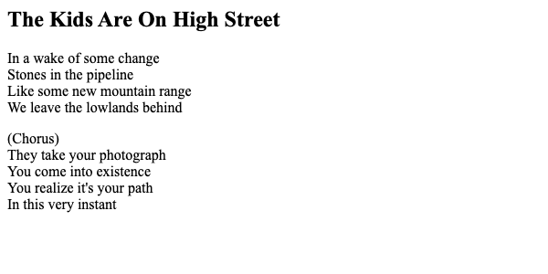
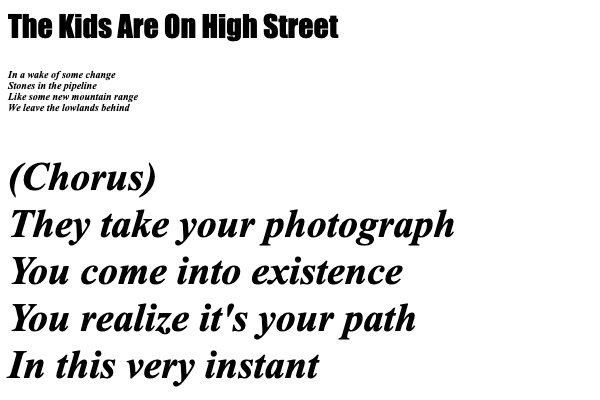
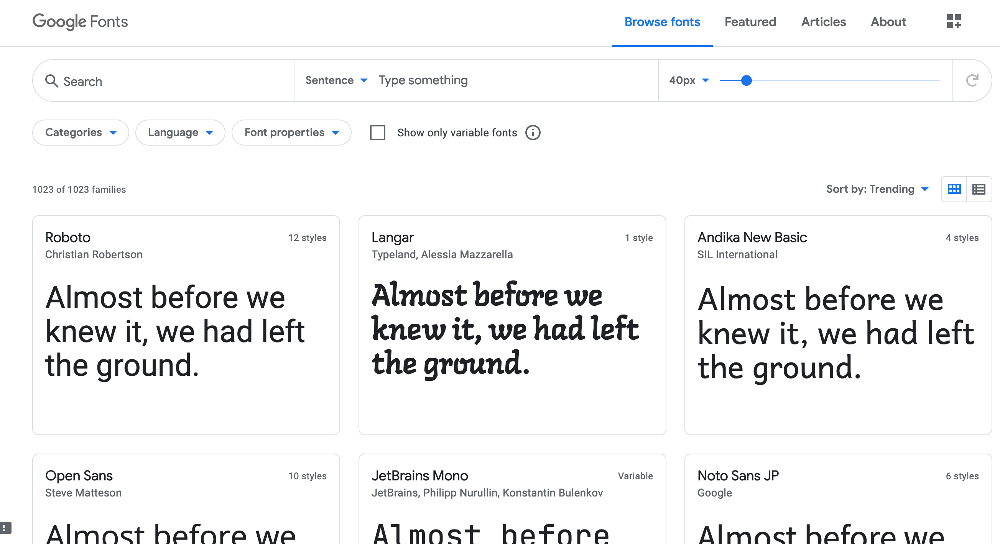
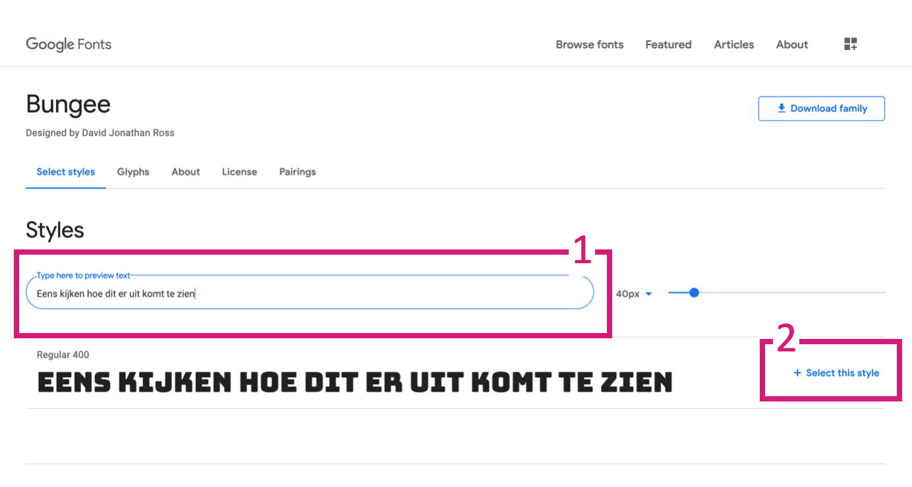
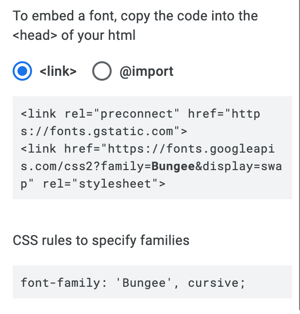
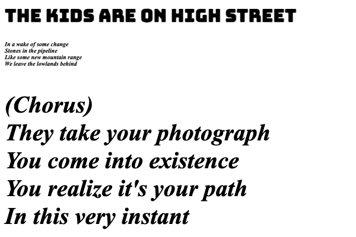

# CSS – Fonts

Aan het eind van deze pagina maken we [oefening 4](../oefeningen/wk1oefening4.md).

Na de kleur is het lettertype vermoedelijk de meest elementaire eigenschap van een pagina. Het is mogelijk de gewenste lettertypen voor de tekst op de website toe te passen door de lettertype-eigenschappen in het css-bestand te gebruiken. Ook is het mogelijk om Google Fonts API te gebruiken om gewenste lettertypen toe te voegen.

Vooraf een waarschuwing. Niet ieder lettertype is niet voor iedere besturingssysteem beschikbaar. Onderstaande links laten zien welke er voor Windows en macOS beschikbaar zijn.

[Fonts die in OS-X beschikbaar zijn](https://en.wikipedia.org/wiki/List_of_typefaces_included_with_macOS)

[Fonts die in Windows beschikbaar zijn](https://en.wikipedia.org/wiki/List_of_typefaces_included_with_Microsoft_Windows)

Bekijk het onderstaande verse html-document

```
<body>
    <h2>The Kids Are On High Street</h2>
    <p> In a wake of some change</br>
        Stones in the pipeline</br>
        Like some new mountain range</br>
        We leave the lowlands behind</p>
    <p id="two">(Chorus)</br>
        They take your photograph</br>
        You come into existence</br>
        You realize it's your path</br>
        In this very instant</p>
  </body>
```

Zonder ondersteuning van een CSS-bestand, wordt de inhoud op de volgende manier afgebeeld:



## Font-eigenschappen

Je kunt het lettertype van de verschillende onderdelen van het html-document styleren door middel van de font-eigenschappen die je met css kunt instellen. Er zijn ook weer *heel veel* van dergelijke eigenschappen met mogelijke waarden. We geven hieronder de belangrijkste, voor een volledig overzicht [verwijzen we weer naar MDN](https://developer.mozilla.org/en-US/docs/Web/CSS/font-family):

Eigenschap   | Waarden | Betekenis
-------------|---------|--------------
font-family  | Lijst van lettertypen | hiermee wordt bepaald welk lettertype <br/> gebruikt moet worden bij de weergave van de tekst.
font-style   | normal   | normaal
             | italic   | cursief
             | oblique  | schuin
font-weight  | normal   | normaal
             | bold     | vet
             | bolder   | vetter
             | lighter  | lichter
font-size    | in px    | exacte hoeveelheid pixels
             | in em    | 1 em is gelijk aan de ingestelde font-grootte

!!! Info "grootheden en eenheden in css"
    Let op de mogelijke waarden die je ziet bij `font-size`. Hier worden twee mogelijkheden gegeven, namelijk `px` en `em`. Er zijn in css verschillende eenheden die je kunt gebruiken als je met grootte wilt werken (bijvoorbeeld hoe groot een plaatje moet worden gerenderd, of hoeveel ruimte een `div` moet innemen). Check hiervoor [deze uitgebreide documentatie op MDN](https://developer.mozilla.org/en-US/docs/Learn/CSS/Building_blocks/Values_and_units).

Stel nu dat we de bovenstaande html verfraaien met de volgende css:

```
h2{
    font-family: 'Impact';
  }

p{

  font-family: 'Lucida Console';
}

body{
  font-size: 20px;
}

p{
  font-size: 10px;
}

#two{
  font-size: 2.0em;
}

p{
  font-style: italic;
  font-weight: bold;
}
```

Dat levert het volgende (niet per se heel fraaie) resultaat op:



## Google fonts 

Er zijn *erg veel* lettertypen beschikbaar (letterlijk duizenden) en het is onmogelijk de effecten van ieder font te kennen. Gelukkig heeft Google ook een fraai overzicht van een flink aantal fonts beschikbaar gesteld.

Bekijk de site [https://fonts.google.com/](https://fonts.google.com/). Er wordt een site geopend waarin op dit moment 1003 font-family’s beschikbaar zijn. 


 
Zoek bijvoorbeeld naar het font ‘Bungee’.


Onder het kopje *Styles* kan tekst aan de al bestaande regel worden toegevoegd. Het resultaat is onmiddellijk zichtbaar. 



Is alles naar wens, dan kies je voor *Select this style*, om de code te zien te krijgen die je in je stylesheet moet opnemen om het gekozen font op je pagina te kunnen gebruiken.



De twee links zijn belangrijk. De onderste link dient in het css-bestand opgenomen te worden bij het geschikte element en de bovenste link moet aan het html-document toegevoegd te worden in de sectie `<head>` onder de link naar het css-bestand.

```
<link rel="stylesheet" href="deel4.css">
<link href="https://fonts.googleapis.com/css2?family=Bungee&display=swap" rel="stylesheet"> 
```

Als we dan de `h2` in het css-bestand als volgt aanpassen:

```
h2{
  font-family: 'Bungee', cursive;
}
```

Dan wordt de uiteindelijke pagina als volgt gerenderd:



## De Inspector

Het kan soms voorkomen dat je bij het surfen over het net een site voorbijkomt, waarvan je denkt ‘Wauwwwww, dat wil ik ook!’. Dat kan in grote lijnen geregeld worden.

- Open de pagina waarvan je de vormgeving wilt nabootsen.
- Selecteer een onderdeel waarop die vormgeving duidelijk is te zien.
- Geef een rechtermuisklik en kies voor ‘Inspecteren’.

Hiermee open je de zogenaamde *inspector*. Hiermee kun je de code van zowel het html-document als van de bijbehorende css-file bekeken worden. Het is zelfs mogelijk ter plekke instellingen van een andere waarde te voorzien om het effect daarvan te kunnen bekijken. De wijzigingen worden alleen doorgevoerd op de geopende view. Andere gebruikers van deze pagina krijgen de aanpassing(en) natuurlijk niet te zien. 


De html van het document zie je aan de linkerkant, de css aan de rechterkant. Door deze css te bestuderen, kun je achterhalen hoe het element dat je hebt geselecteerd is vormgegeven. 

Deze *inspector* is een heel belangrijk hulpmiddel voor al het front-end werk. We zullen hier dan ook later nog uitgebreid op terugkomen.

Maak nu [oefening 4](../oefeningen/wk1oefening4.md).
