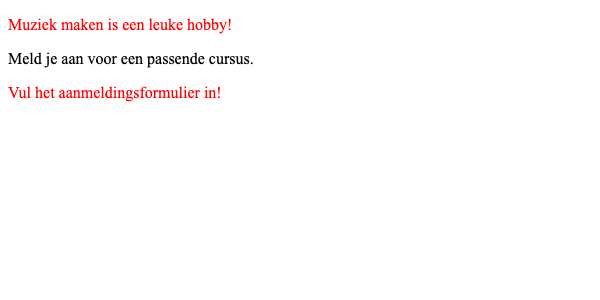

# CSS – Inleiding

Cascading Style Sheets (CSS) is de code die wordt gebruikt om webpagina’s van een stijl te voorzien. Net zoals HTML is CSS  niet echt een programmeertaal, maar het is ook niet echt een opmaaktaal zoals html. Je zou kunnnen zeggen dat het een *stijltaal* is: het stelt een ontwerper in staat om diverse stijlen en stijlvormen op geselecteerde elementen in een HTML-document toe te passen.

Hieronder zie je een stukje css. Deze code zorg ervoor dat de tekst van alle paragrafen (alles met het element `<p>`) *rood* wordt weergegeven. 

```
p {
  color: red;
}
```

Je kunt css in het html-bestand zelf schrijven, maar je kunt het ook in een separaat bestand opslaan. Die laatste methode is wel makkelijker, omdat je op die manier dezelfde *stylesheet* in verschillende hmlt-bestanden kunt gebruiken. Om ervoor te zorgen dat een html-bestand gebruik kan maken van een css-bestand, moet je een koppeling tussen deze twee aanbrengen. Dat doe je in de `header` van het html-bestand (dus tussen `<head>` en `</head>`).


```
<!DOCTYPE HTML>
<html> 
    <head> 
        <title>Test CSS</title> 
        <!-- met deze regel koppelen we de stylesheet aan deze html -->
        <link href="stijl.css" rel="stylesheet" type="text/css">
    </head> 
    <body>        
        <p>Muziek maken is een leuke hobby!</p>
        Meld je aan voor een passende cursus.
        <p>Vul het aanmeldingsformulier in!</p>
    </body> 
</html>
```




Alle tekst opgenomen binnen een paragraaf heeft daadwerkelijk een rode kleur gekregen.

!!! info "External, Internal en Inline"
    Je kunt de style van html op drie plekken neerzetten: *external*, *internal* of *inline*. Alles stijl die je definieert in een extern bestand (een ander bestand dan het html-bestand waar het betrekking op heeft) is *external*. Stijl die je definieert in het html-bestand zelf (tussen `<style>` en `</style` in de `header`) is *internal*. Verder kun je ook stijl aangeven in het `style`-attribuut van een html-tag: dit zijn zogenaamde *inline* styles.

    Waar je je css neerzet heeft repercussies voor hoe *sterk* de verschillende regels zijn. Externe regels zijn het zwakst, terwijl de *inline* styles het sterkst zijn. Dat betekent dat als een element door meerdere regels wordt gestyled, dat de inline-regels het altijd winnen.

## De anatomie van css-regels

Voordat er dieper op de materie wordt ingegaan aandacht voor de anatomie van een set CSS-regels. 


