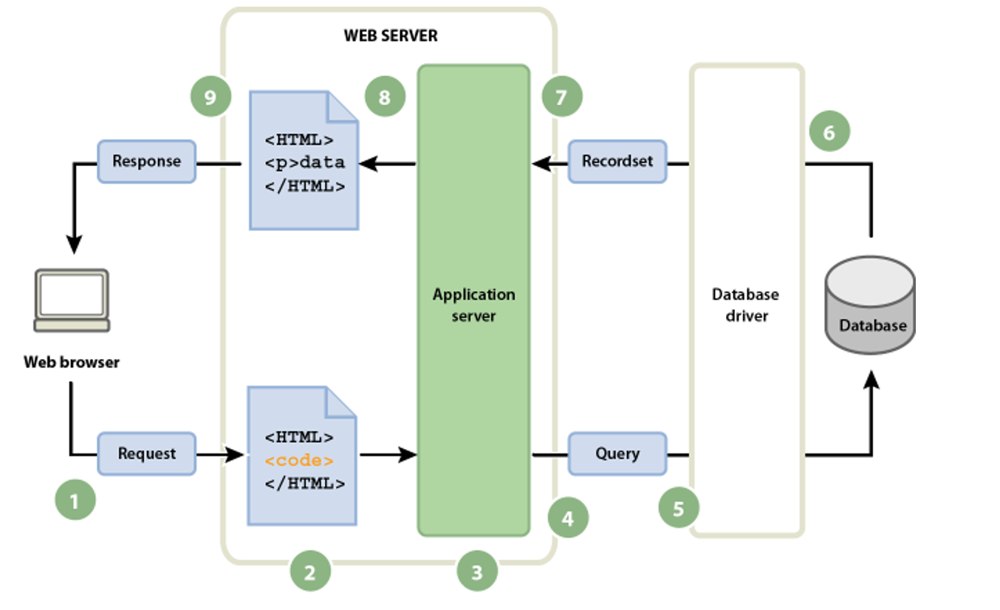

# OOP Python – inleiding

Tot nu toe hebben we ons gericht op vormgeving van teksten en dergelijke aan de *client-kant* van onze webapplicatie. Om hier *functionaliteit* aan toe te voegen, kunnen we twee dingen doen:

- met behulp van JavaScript programmacode aan de *client-kant* zelf toevoegen, of
- met behulp van een zogenaamde backend-programmeertaal functionaliteit aan de *server-kant* toevoegen en het resultaat daarvan terugsturen naar de client.

Om dit wat nader toe te lichten, herhalen we hier het plaatje uit week 1; bekijk eventueel [de beschrijving daarbij op de betreffende pagina](../week1/1.html/html-deel1.md):



Voor deze module hebben we voor de tweede optie gekozen. JavaScript en front-end development komen uitgebreid aan bod in het tweede jaar.

We beginnen met een stukje herhaling over het object-georiënteerde programmeerparadigma in Python. Dat doen we niet zomaar: in week 1 heb je de eerste pagina's voor de fictieve muziekschool *Sessions* gebouwd, en deze week gaan we de *wereld achter* die site modelleren — instrumenten, cursisten, docenten en lessen. Precies die klassen komen later in de module terug, wanneer we ze met Flask en een database verbinden.

## Wat is OOP?

Tot nu toe is er geprogrammeerd volgens het imperatieve paradigma. Een programma gemaakt volgens dit principe bestaat uit een groot aantal coderegels die in een bepaalde volgorde geplaatst zijn en waarop de computer verteld wordt hoe deze regels uit te voeren.

OOP (*Object Oriented Programming*) is een programmeerstijl (of *paradigma*) waarbij logische objecten gemaakt worden die methodes (functies, acties of gebeurtenissen) en eigenschappen (waarden) hebben. De bedoeling is dat dit leidt tot herbruikbare en beter leesbare programmacode. Conceptueel bestaat een programma uit objecten die aangemaakt worden en met elkaar interacteren.

Het is niet zo dat beide stijlen onafhankelijk van elkaar functioneren. Binnen OOP wordt gebruikt gemaakt van de imperatieve coderingswijze en bij het imperatieve paradigma komen objecten regelmatig voor, zonder dat een gebruiker er vaak weet van heeft.

## Klasse-definitie

Om te beginnen een simpel voorbeeld om het principe van klassen en methoden uit te leggen. Muziekschool Sessions verhuurt instrumenten aan cursisten, en die verhuur willen we kunnen beheren. Bekijk het bestand [`instrument.py`](bestanden/muziekschool/instrument.py).

```ipython
In [1]: class Instrument:
   ...:
```

Een klasse wordt gedefinieerd door het woord `class`, gevolgd door de naam van de klasse, beginnend met een hoofdletter. De klassedefinitie wordt afgesloten met een dubbele punt (`:`).

Nu is het de beurt om aan te geven uit welke attributen of eigenschappen deze class bestaat. Dit geven we mee aan de methode die aangeroepen wordt wanneer er een object van een klasse wordt aangemaakt: de zogenaamde *constructor*. In Python is deze methode `__init__` (we komen daar zo wat uitgebreider op terug):

```ipython
   ...:     def __init__(self, naam, huurprijs, voorraad):
   ...:         self.naam = naam
   ...:         self.huurprijs = huurprijs
   ...:         self.voorraad = voorraad
   In [2]:
```

Het zijn er drie (3): `naam`, `huurprijs`, `voorraad`. De notatie `self` lijkt nu nog wat vreemd, maar dat went snel; zie eventueel [deze blogpost](https://www.bartbarnard.nl/programmeerblogs/python/self.html) voor meer informatie rondom `self`.

Nu de klasse is gedefinieerd kunnen we er objecten van maken – een ander woord hiervoor is *instantie*: we maken *instanties* van de klasse `Instrument`:

```ipython
In [2]: gitaar = Instrument("Elektrische gitaar", 17.50, 5)
```

Er is een object aangemaakt met de naam `gitaar`. Bij het aanmaken van deze nieuwe instantie is de invulling van drie eigenschappen verplicht. In de definitie van de klasse wordt gevraagd om `naam`, `huurprijs` en `voorraad`, dus deze drie waarden moeten opgegeven worden. Gebeurt dat niet, verschijnt er een foutmelding. Deze coderegel wil dus zeggen dat er een instantie (`gitaar`) is aangemaakt van de klasse (`Instrument`) waarbij naam (`Elektrische gitaar`), huurprijs (`17.50`) en voorraad (`5`) als verplichte waarden worden meegegeven. De inhoud van de waarden van de velden van de instantie `gitaar` kunnen ook getoond worden:

```ipython
In [3]: gitaar.naam
Out[3]: 'Elektrische gitaar'

In [4]: gitaar.huurprijs
Out[4]: 17.5

In [5]:
```

Uiteraard kunnen er meerdere objecten bij deze klasse worden aangemaakt. Een tweede instrument is bijvoorbeeld een keyboard.

```ipython
In [5]: keyboard = Instrument("Keyboard", 12.50, 8)
```

De gegevens van beide objecten kunnen ook gecombineerd worden getoond.

```ipython
In [6]: print(f"Te huur: {gitaar.naam} = €{gitaar.huurprijs} p/m, {keyboard.naam} = €{keyboard.huurprijs} p/m")
Te huur: Elektrische gitaar = €17.5 p/m, Keyboard = €12.5 p/m

In [7]:
```

Voor de overzichtelijkheid eerst een aantal beschrijvingen:

Term | Omschrijving
-----|------
Klasse | template, sjabloon voor het maken van objecten; alle objecten die met dezelfde klasse zijn gemaakt, hebben dezelfde kenmerken.
Object | een instantie van een klasse.
Initialisatie | een nieuw object van een klasse.
Methode | een functie gedefinieerd in een klasse.
Attribuut | een variabele die is gebonden aan een object van een klasse.

## Instrumenten verhuren

We breiden de definitie van `Instrument` uit met een tweede methode `verhuur()`. Het woord `self` moet je altijd aan een methode-definitie toevoegen, zelfs wanneer de methode zelf verder helemaal geen parameters heeft.

Deze methode verhuurt een aantal exemplaren en past de voorraad aan.

```python
def verhuur(self, aantal):
    """Verhuur een aantal exemplaren van dit instrument"""
    nieuwe_voorraad = self.voorraad - aantal
    if nieuwe_voorraad >= 0:
        self.voorraad = nieuwe_voorraad
        print(f"Verhuurd: {aantal}x {self.naam}. Nog {self.voorraad} beschikbaar")
    else:
        print(f"Onvoldoende exemplaren. Nog maar {self.voorraad} beschikbaar")
```

## Een mooiere weergave met `__str__()`

Het kan handig zijn als we een instrument netjes kunnen printen. Daarvoor gebruiken we de speciale methode `__str__()`:

```python
def __str__(self):
    return f"Instrument: {self.naam}, Huurprijs: €{self.huurprijs:.2f} p/m, Beschikbaar: {self.voorraad}"
```

De volledige klasse ziet er nu als volgt uit:

```python
class Instrument:
    """Klasse voor huurinstrumenten van muziekschool Sessions"""

    def __init__(self, naam, huurprijs, voorraad):
        self.naam = naam
        self.huurprijs = huurprijs
        self.voorraad = voorraad

    def verhuur(self, aantal):
        """Verhuur een aantal exemplaren van dit instrument"""
        nieuwe_voorraad = self.voorraad - aantal
        if nieuwe_voorraad >= 0:
            self.voorraad = nieuwe_voorraad
            print(f"Verhuurd: {aantal}x {self.naam}. Nog {self.voorraad} beschikbaar")
        else:
            print(f"Onvoldoende exemplaren. Nog maar {self.voorraad} beschikbaar")

    def __str__(self):
        return f"Instrument: {self.naam}, Huurprijs: €{self.huurprijs:.2f} p/m, Beschikbaar: {self.voorraad}"
```

## Testen van meerdere verhuringen

Laten we nu meerdere verhuringen uitvoeren om te zien hoe de voorraad wordt bijgehouden:

```python
gitaar = Instrument("Elektrische gitaar", 17.50, 5)
print(gitaar)

gitaar.verhuur(2)
print(gitaar)

gitaar.verhuur(2)
print(gitaar)

gitaar.verhuur(2)  # Dit zal niet lukken - onvoldoende exemplaren!
print(gitaar)
```

Resultaat:

```console
Instrument: Elektrische gitaar, Huurprijs: €17.50 p/m, Beschikbaar: 5
Verhuurd: 2x Elektrische gitaar. Nog 3 beschikbaar
Instrument: Elektrische gitaar, Huurprijs: €17.50 p/m, Beschikbaar: 3
Verhuurd: 2x Elektrische gitaar. Nog 1 beschikbaar
Instrument: Elektrische gitaar, Huurprijs: €17.50 p/m, Beschikbaar: 1
Onvoldoende exemplaren. Nog maar 1 beschikbaar
Instrument: Elektrische gitaar, Huurprijs: €17.50 p/m, Beschikbaar: 1
```

Perfect! Onze instrument-klasse houdt netjes de voorraad bij en waarschuwt wanneer er niet genoeg exemplaren beschikbaar zijn.

## Samenvatting

In dit deel hebben we kennisgemaakt met:

- Het definiëren van een klasse met `class`
- De constructor `__init__()` om objecten te initialiseren
- Attributen (eigenschappen) van een klasse
- Methoden (functies binnen een klasse)
- Het aanmaken van instanties (objecten)
- De speciale methode `__str__()` voor nette weergave

In het volgende deel gaan we dieper in op het beschermen van attributen: *inkapseling*, en de nette manier om toch bij die attributen te kunnen met getters, setters en properties.
