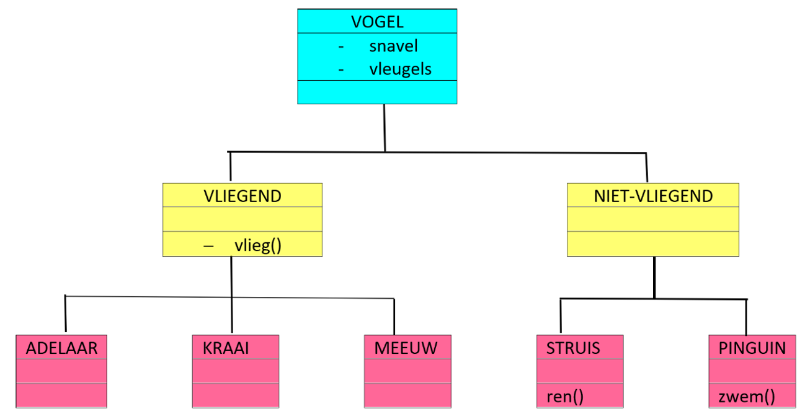

# OOP Python – Overerving en polymorfisme

Overerving is een mechanisme waarmee het probleem van gedupliceerde code opgelost kan worden. Het concept is eenvoudig. Stel je voor dat we een model willen maken van verschillende typen vogels. Dan kun je je voorstellen dat dat model er bijvoorbeeld als volgt uit zou komen te zien:

Aan het eind van deze tekst maken we [oefening nummer 2](oefeningen/oop-oefening2.md).



## Het principe van overerving

Deze afbeelding laat het principe van overerving duidelijk zien. Op het plaatje zijn allemaal vogels te zien. Een kenmerk van alle vogels is dat zij allen een snavel hebben en vleugels. De kenmerken die voor alle vogels gelden, worden zoveel mogelijk centraal vastgelegd, hier dus in de klasse `VOGEL`.

Daarna is er een tweedeling te zien tussen vogels die kunnen vliegen en vogels die die capaciteit niet beheersen. Alle vogels die kunnen vliegen bezitten de methode `vlieg()`. Deze methode wordt zo hoog mogelijk in de hiërarchie opgeslagen, hier in `VLIEGEND`. De vogels die niet kunnen vliegen hebben blijkbaar geen gemeenschappelijke methode. De struisvogel kan hardlopen (`ren()`) en de pinguïn kan zwemmen (`zwem()`). Omdat dit dus allemaal individuele methoden zijn, worden ze in de klasse zelf opgeslagen.

Dat levert het volgende overzicht op:

Term | Omschrijving
---|---
Overerving | Het definiëren van een klasse als uitbreiding van een andere klasse.
Superklasse | Een klasse die uitgebreid wordt door een andere klasse.
Subklasse | Een klasse die een uitbreiding erft van een andere klasse. Een subklasse erft alle attributen en methoden van de bijbehorende superklasse.

Zo is `VOGEL` een superklasse van `VLIEGEND` en is `VLIEGEND` een subklasse van `VOGEL`. Maar `VLIEGEND` is tegelijkertijd een superklasse van `ADELAAR`, `KRAAI` en `MEEUW`. Super- en subklasse is een transitieve eigenschap: `VOGEL` is ook een superklasse van `KRAAI`.

## De klasse `Persoon`

Terug naar muziekschool Sessions. Bij de school lopen verschillende soorten mensen rond: *docenten* en *cursisten*. Beiden hebben een naam en een e-mailadres, en beiden moeten zich kunnen voorstellen. Die gemeenschappelijke kenmerken leggen we vast in een superklasse `Persoon`, in het bestand [`persoon.py`](bestanden/muziekschool/persoon.py):

!!! Info "Werken vanuit een bestand"
    Vanaf nu werken we vanuit bestanden om de werking van de code te demonstreren. Dat is directer en makkelijker dan telkens alles in de interactieve shell opnieuw in te laden. Probeer dit voor je eigen project ook op deze manier te doen.

```python
class Persoon:
    """Superklasse voor alle personen bij muziekschool Sessions"""

    def __init__(self, naam, email):
        self._naam = naam
        self._email = email

    def stel_voor(self):
        print(f"Hallo, ik ben {self._naam}")

    def __str__(self):
        return f"{self._naam} ({self._email})"
```

## De klasse `Docent`

Nu de eerste subklasse: let op de wijze waarop we aangeven dat `Docent` een subklasse is van `Persoon`.

```python hl_lines="1"
class Docent(Persoon):
    pass
```

Een beetje apart om een commando op te nemen in de definitie van een klasse dat niets doet. Het commando `pass` heeft tot doel invulling te zijn op het moment dat er een actie gevraagd wordt, maar er eigenlijk geen reden toe is een actie in de code op te nemen.

Ook zonder eigen code erft `Docent` alles van `Persoon`:

```python
bart = Docent("Bart", "bart@sessions.nl")
bart.stel_voor()
```

```console
Hallo, ik ben Bart
```

De klasse `Docent` kent geen eigen methode `__init__()`. Voor de invulling wordt daarom gekeken of de superklasse wél een methode `__init__()` kent, waarvan de attributen gebruikt kunnen worden. Die is er, de volgorde van de parameters klopt en Python snapt de bedoeling.

Maar een docent heeft méér dan een naam en een e-mailadres: een docent geeft les in een instrument en hanteert een uurtarief. De klasse `Docent` krijgt daarom een eigen constructor. De aanroep `super().__init__()` zorgt ervoor dat de constructor van de superklasse (`Persoon`) wordt aangeroepen voor de gemeenschappelijke attributen:

```python
class Docent(Persoon):
    """Een docent geeft les in een bepaald instrument"""

    def __init__(self, naam, email, instrument, uurtarief=40.0):
        super().__init__(naam=naam, email=email)
        self._instrument = instrument
        self._uurtarief = uurtarief
```

## Extra eigenschappen in de subklasse

Het is ook mogelijk extra methoden bij een subklasse in te bouwen. Als voorbeeld een methode voor de klasse `Docent`:

```python
def bereken_lesprijs(self, minuten):
    prijs = self._uurtarief * minuten / 60
    print(f"Een les van {minuten} minuten bij {self._naam} kost €{prijs:.2f}")
    return prijs
```

Een test:

```python
bart = Docent("Bart", "bart@sessions.nl", "gitaar")
bart.bereken_lesprijs(45)
```

Resultaat:

```console
Een les van 45 minuten bij Bart kost €30.00
```

Deze methode is alleen beschikbaar voor de objecten uit de klasse `Docent`. Een object van de klasse `Persoon` (of straks `Cursist`) kan deze methode niet benaderen.

## Overriding

Binnen subklassen kunnen methodes ingebouwd worden die dezelfde naam hebben als methodes in hun superklasse: de methode wordt dan *overschreven* (Engels: *overriding*). Wanneer een docent zich voorstelt, willen we bijvoorbeeld ook weten waarin hij of zij lesgeeft. We geven `Docent` daarom een eigen versie van `stel_voor()`:

```python
class Docent(Persoon):

    def __init__(self, naam, email, instrument, uurtarief=40.0):
        super().__init__(naam=naam, email=email)
        self._instrument = instrument
        self._uurtarief = uurtarief

    def stel_voor(self):
        print(f"Hallo, ik ben {self._naam} en ik geef les in {self._instrument}")
```

Wanneer nu `stel_voor()` wordt aangeroepen op een `Docent`-object, wordt eerst gekeken of de methode voorkomt in de klasse `Docent` zelf, en pas daarna in de klasse erboven. De docent-versie *wint* dus van de persoon-versie.

Op dezelfde manier maken we een subklasse `Cursist`, met een geboortejaar (handig voor jeugdkorting, later) en een eigen `stel_voor()`:

```python
class Cursist(Persoon):
    """Een cursist volgt lessen bij Sessions"""

    def __init__(self, naam, email, geboortejaar):
        super().__init__(naam=naam, email=email)
        self._geboortejaar = geboortejaar

    def stel_voor(self):
        print(f"Hallo, ik ben {self._naam} en ik ben cursist bij Sessions")
```

## Polymorfisme

Het woord *polymorfisme* is samengesteld uit twee Griekse woorden: *polus* (πολύς, wat 'veel' betekent) en *morphè* (μορφή, wat 'vorm' betekent). Iets wat polymorf is, kan dus veel (verschillende) vormen aannemen. In de informatica wil dat zeggen dat een methode met dezelfde *naam* (*signature*) verschillende *vormen* kan hebben. Je kunt dus verschillende methoden op dezelfde manier aanspreken, afhankelijk van de klasse die deze methode implementeert.

Een eerste, eenvoudig voorbeeld ken je eigenlijk al:

```python
a = 3
b = "tim"
c = 1, 2, 3

print(a)
print(b)
print(c)
```

```console
3
tim
(1, 2, 3)
```

Python heeft er geen enkele moeite mee om verschillende typen objecten (hier: `int`, `string` en `tuple`) naar het scherm te schrijven. Dat komt omdat alle typen beschikken over de methode `__str__()`. De functie `print()` kan daardoor in vele situaties succesvol toegepast worden: polymorfisme.

Nu een voorbeeld met onze eigen klassen. We zetten een docent, een cursist en een 'gewone' persoon bij elkaar in een lijst en laten iedereen zich voorstellen:

```python
bart = Docent("Bart", "bart@sessions.nl", "gitaar")
roos = Cursist("Roos", "roos@email.nl", 2007)
henk = Persoon("Henk", "henk@email.nl")

for persoon in [bart, roos, henk]:
    persoon.stel_voor()
```

Wat blijkt? Moeiteloos:

```console
Hallo, ik ben Bart en ik geef les in gitaar
Hallo, ik ben Roos en ik ben cursist bij Sessions
Hallo, ik ben Henk
```

Dit is een mooi voorbeeld van polymorfisme: we roepen drie keer *dezelfde* methode aan (`stel_voor()`), maar afhankelijk van de klasse van het object wordt een *andere* implementatie uitgevoerd. De aanroepende code (de `for`-lus) hoeft helemaal niet te weten met welk type persoon hij te maken heeft.

Er is nog (heel veel) meer te zeggen over polymorfisme; [check eventueel de wiki-pagina hierover](https://nl.wikipedia.org/wiki/Polymorfisme_(informatica)). Voor nu is het voldoende als je weet dat dit bestaat – in een later stadium komen we hier nog uitgebreid op terug.

## Samenvatting

In dit deel hebben we geleerd over:

- Overerving: subklassen die attributen en methoden van een superklasse overnemen
- `super().__init__()` om de constructor van de superklasse aan te roepen
- Extra attributen en methoden in een subklasse
- Overriding: een methode uit de superklasse overschrijven in de subklasse
- Polymorfisme: dezelfde aanroep, verschillend gedrag per klasse

In het volgende deel bekijken we hoe meerdere klassen samenwerken: *compositie*.

Maak nu [oefening nummer 2](oefeningen/oop-oefening2.md).
