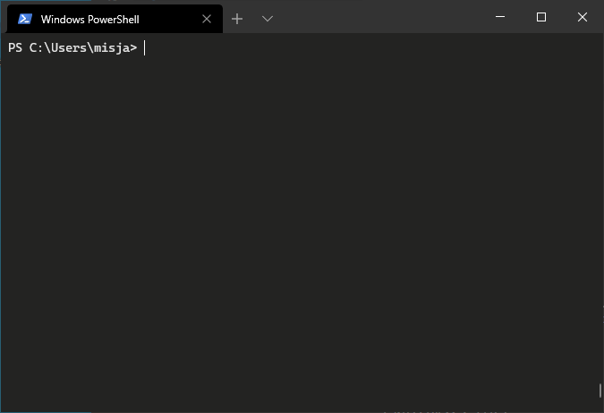
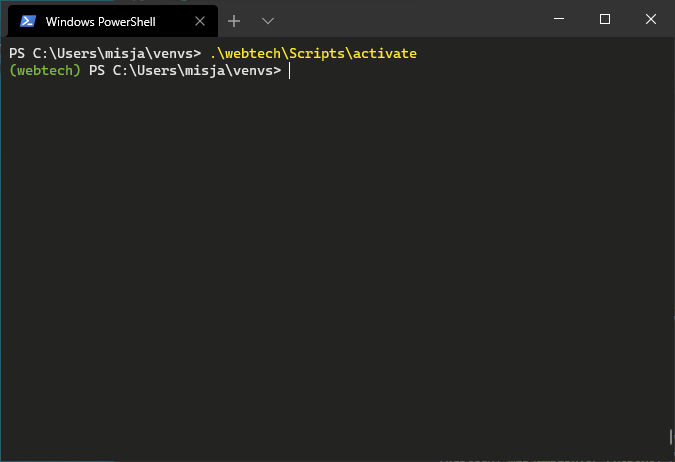

# Flask – Installatie

Er zijn meerdere manieren om Flask te installeren en er gelijk mee te kunnen werken. Hier wordt de meest gebruikelijke wijze getoond waarbij we gebruik maken van een Python *virtuele omgeving*.

## Wat is een virtuele omgeving?

In de kern is het belangrijkste doel van virtuele Python-omgevingen het creëren van een geïsoleerde omgeving voor Python-projecten. Dit betekent dat elk project zijn eigen afhankelijkheden kan hebben, ongeacht welke afhankelijkheden elk ander project heeft. Het mooie hiervan is dat er geen limieten zijn aan het aantal omgevingen, aangezien het slechts mappen (directories) zijn met een paar scripts en bovendien kunnen ze eenvoudig worden gemaakt met Python zelf.

## Stappenplan installatie:

### Stap 1: open een command line

In thema 1.1 en 1.2 hebben we ook al gewerkt met een command line. Op macOS kun je eenvoudig het programma *Terminal* openen, op Windows kan je 'PowerShell' gebruiken of 'Cmd' gebruiken. We raden hier PowerShell aan omdat je alle commando's die we straks gaan noemen ook daar kan gebruiken (bijvoorbeeld `mkdir`, `cd` en `ls`). In alle gevallen kom je als je het programma opstart standaard in je *home directory* (`~/`) terecht.

!!! tip "Microsoft Windows Terminal"

    Op Windows 11 is [Windows Terminal](https://apps.microsoft.com/detail/9n0dx20hk701) de standaard terminal-applicatie; op oudere Windows-versies kun je deze via de Microsoft Store installeren.

    

    Een voordeel van deze terminal is dat je hem naar eigen smaak kan aanpassen (configureren) maar ook dat hij kleuren en bijvoorbeeld emoji goed ondersteunt (👍).

    Command line toepassingen lijken iets uit het verleden maar zijn nog steeds erg belangrijk, zo belangrijk zelfs dat Microsoft heel druk is deze omgeving opnieuw te ontwikkelen bijvoorbeeld met deze nieuwe terminal. Zie [Windows Command-Line: Backgrounder](https://devblogs.microsoft.com/commandline/windows-command-line-backgrounder/) als je het interessant vindt om meer over de geschiedenis van de command line te weten en waarom Microsoft deze omgeving voor Windows moderniseert.

Editors als bijvoorbeeld [VSCode](https://code.visualstudio.com/) of [Pycharm](https://www.jetbrains.com/pycharm/) hebben veelal een ingebouwde terminal, voor alle stappen die we nu gaan doorlopen kan je daar natuurlijk ook gebruik van maken (maar voor Windows gebruikers, let op dat daar PowerShell in wordt geopend).

### Stap 2: een directory voor virtuele omgevingen

Maak met `mkdir` een directory aan waar je jouw Python virtuele omgeving(en) gaat beheren. Deze directory mag elke naam hebben, we kiezen in het voorbeeld hieronder voor de naam 'venvs'

```console
~ $> mkdir venvs
~ $>
```

### Stap 3: het aanmaken van een virtuele omgeving

Nu is het tijd om een virtuele omgeving aan te maken, in dit geval voor alles wat met de ontwikkeling van een webapplicate te maken heeft. Stap met `cd` (*change directory*) naar de directory die je net hebt aangemaakt voor het beheer van virtuele omgevingen:

```console
~ $> cd venvs
~/venvs $>
```

Een virtuele omgeving mag ook elke naam hebben die je maar wilt, we kiezen in dit voorbeeld voor `webtech` omdat de naam iets zegt over het doel van de virtuele omgeving, namelijk webtechnologie! Maak de virtuele omgeving met Python als volgt aan:

=== "macOS / Linux"

    ```console
    python3 -m venv webtech
    ```

=== "Windows"

    ```console
    python.exe -m venv webtech
    ```

Met de toevoeging `-m venv` zeg je tegen Python de `venv` module te gebruiken met als argument de directory waar de omgeving in moet worden aangemaakt (`webtech`). Nadat het commando is ingegeven en er op `<ENTER>` is gedrukt zal het enige tijd duren voordat het klaar is, er wordt in de tussentijd van alles geïnstalleerd.

Controleer of deze stap is gelukt, typ `ls` (*list directory contents*) om de inhoud van de directory te bekijken. Als het goed is zal je nu een *subdirectory* `webtech` zien:

```console
~/venvs $> ls
webtech
~/venvs $>
```

Er is een virtuele omgeving aangemaakt met de naam `webtech` en in die directory zijn een aantal subdirectories en bestanden neergezet. De subdirectory `Scripts` (Windows) of `bin` (macOS / Linux) laat het volgende zien:


=== "macOS / Linux"

    ```text
    webtech/bin/
    ├── Activate.ps1
    ├── activate
    ├── activate.csh
    ├── activate.fish
    ├── pip
    ├── pip3
    ├── pip3.13
    ├── python -> python3
    └── python3 -> /usr/bin/python3
    ```

=== "Windows"

    ```text
    webtech/Scripts/
    ├── Activate.ps1
    ├── activate
    ├── activate.bat
    ├── deactivate.bat
    ├── pip.exe
    ├── pip3.13.exe
    ├── pip3.exe
    ├── python.exe
    └── pythonw.exe
    ```

Als je verder gaat rondkijken zal je zien dat een virtuele omgeving eigenlijk een mini-Python installatie is. Het is een flink rijtje bestanden, maar ongelukkigerwijze ontbreekt Flask nog. Om dat te kunnen installeren moeten we eerst onze nieuwe virtuele omgeving activeren en daar gaan we de scripts in de subdirectory `Scripts` of `bin` voor gebruiken.

### Stap 4: het activeren van de virtuele omgeving.

=== "macOS / Linux"

    ```console
    ~/venvs $> source webtech/bin/activate
    (webtech)~/venvs $>
    ```

=== "Windows"

    ```console
    ~/venvs $> .\webtech\Scripts\activate
    (webtech)~/venvs $>
    ```

Je zal zien dat de command prompt nu wordt aangevuld met de naam van de virtuele omgeving tussen haakjes. Dit is het teken dat de virtuele omgeving is geactiveerd!



!!! warning "Activeren"
    De virtuele omgeving wordt alleen voor de huidige terminal sessie geactiveerd en *niet* voor het hele systeem. Je zult dit zien als je een nieuwe command line opent: daar zal je opnieuw de virtuele omgeving moeten activeren om er gebruik van te kunnen maken.

### Stap 5: toevoegen module Flask.

Om de module Flask te installeren maken we gebruik van `Python Package Installer`, oftewel [`pip`](https://pypi.org/project/pip/), als je goed hebt opgelet zag je deze al in de `Scripts` of `bin` directory staan.

Nu de virtuele omgeving is geactiveerd zijn `pip` en de andere scripts overal aan te roepen. Bijvoorbeeld, `cd` terug naar de home directory:

```console
(webtech)~/venvs $> cd ..
(webtech)~ $>
```

Roep vervolgens `pip` aan om Flask als volgt te installeren:

```console
(webtech)~ $> pip install flask
```

Er wordt weer hard gewerkt achter de schermen en het eindresultaat mag er weer zijn. Controleer nu de inhoud van de directory `venvs/webtech/Scripts` (Windows) of `venvs/webtech/bin` (macOS / Linux) en je zult zien dat een nieuw script is toegevoegd

=== "macOS / Linux"

    ```text hl_lines="8"
    venvs/webtech/bin/
    ├── Activate.ps1
    ├── activate
    ├── activate.csh
    ├── activate.fish
    ├── flask
    ├── pip
    ├── pip3
    ├── pip3.13
    ├── python -> python3
    └── python3 -> /usr/bin/python3
    ```

=== "Windows"

    ```text hl_lines="8"
    venvs/webtech/Scripts/
    ├── Activate.ps1
    ├── activate
    ├── activate.bat
    ├── deactivate.bat
    ├── flask.exe
    ├── pip.exe
    ├── pip3.13.exe
    ├── pip3.exe
    ├── python.exe
    └── pythonw.exe
    ```

Dit script gaan we straks gebruiken om het opstarten van onze applicatie tijdens het ontwikkelen te vergemakkelijken. Je kan het direct al aanroepen om bijvoorbeeld de geïnstalleerde versie op te vragen:

```console
(webtech)~ $> flask --version
Python 3.13.1
Flask 3.1.0
Werkzeug 3.1.3
```

Als laatste test proberen we de Flask *module* te importeren in de interactieve python-shell:

=== "macOS / Linux"

    ```console hl_lines="5"
    (webtech)~ $> python3
    Python 3.13.1 (main, Dec  3 2024, 17:59:52)
    Type "help", "copyright", "credits" or "license" for more information.
    >>> import flask
    >>> flask.__version__
    '3.1.0'
    >>>
    ```

=== "Windows"

    ```console hl_lines="4"
    (webtech)~ $> python.exe
    Python 3.13.1 (tags/v3.13.1:0671451, Dec  3 2024, 19:06:28) [MSC v.1942 64 bit (AMD64)] on win32
    Type "help", "copyright", "credits" or "license" for more information.
    >>> import flask
    >>> flask.__version__
    '3.1.0'
    >>>
    ```

!!! notice "Werkomgeving"
    Je ziet dat zodra een virtuele omgeving is geactiveerd alle commando's (`python`, `pip`, `flask` etc.) verwijzen naar de `Scripts` (of `bin`) directory in de virtuele omgeving. Dit betekent ook dat het niet uitmaakt waar je jouw werkomgeving hebt voor Python-bestanden, en het is zelfs een goed gebruik om deze gescheiden te houden.

## Afsluiten van de virtuele omgeving

Een gebruikelijke manier om de virtuele omgeving af te sluiten is met:

```console
(webtech)~ $> deactivate
~ $>
```

## Anaconda Python

Het kan zijn dat je de [Anaconda](https://www.anaconda.com/) Python distributie hebt geïnstalleerd. Alles wat hier beschreven is geldt ook voor deze omgeving, hoewel je met de geïnstalleerde command line tool `conda` ook virtuele omgevingen kan aanmaken en beheren. Zie [de documentatie](https://docs.conda.io/projects/conda/en/latest/user-guide/tasks/manage-environments.html) voor meer informatie.


