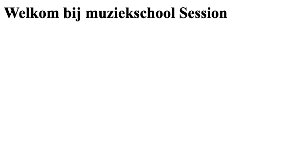
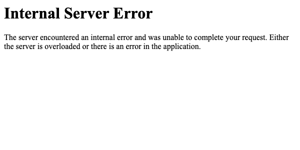
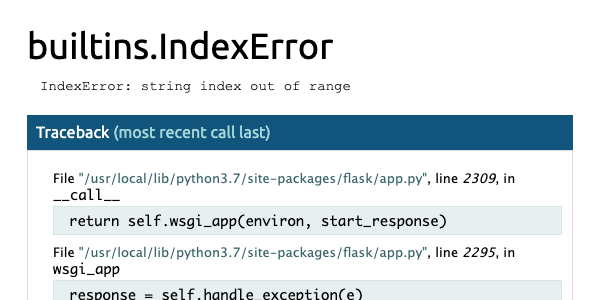
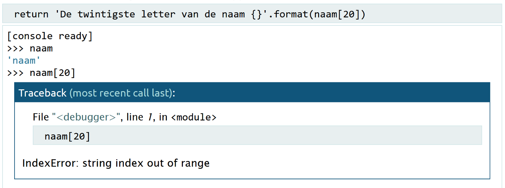

# Flask – basale werking

Vanuit vogelvluchtperspectief werkt Flask als volgt. Er komt een request binnen bij de server. De server checkt welke route er exact wordt opgevraagd en voert de daarmee corresponderende functie uit. Deze functie retourneert iets, in de regels een string, wat door de server weer wordt doorgestuurd aan de client.

Aan het eind van deze tekst maken we [oefening 1](oefeningen/flask-oefening1.md)

## Een voorbeeld

We maken die duidelijk aan de hand van een voorbeeld. We maken een scriptje `server.py`, waarin we allereerst de klasse `Flask` importeren en daar vervolgens een instantie van aanmaken.

```python
from flask import Flask
app = Flask(__name__)
```

Om aan te geven dat we een bepaalde string willen retourneren bij bij een specifieke request, maken we gebruik van een zogenaamde *decorator*: een speciale constructie weermee je functionaliteit aan een functie kunt toevoegen. Door middel van de decorator `@app.route()` kunnen we aangeven dat de functie die daarmee gedecoreerd is moet worden uitgevoerd op het moment dat die specifiek request gevraagd wordt. Zie het onderstaande voorbeeld, waaraan we voor de duidelijkheid regelnummer hebben toegevoegd.

<!-- Ik dacht toch werkelijk dat je regelnummers in fenced code block aan kon zetten -->
<!-- maar lijkt toch van niet. Dus maar met de hand -->
<!-- https://stackoverflow.com/questions/55653184/enable-line-numbers-for-specific-markdown-code-listings-designated-with-backtick

HOEM: dit kan met mkdocs (nadeel, niet overdraagbaar naar andere omgevingen)
https://squidfunk.github.io/mkdocs-material/reference/code-blocks/#adding-line-numbers
-->

```python linenums="1"
@app.route('/')
def index():
    # render de template Basic.html
    return '<h1>Welkom bij muziekschool Session</h1>')

if __name__ == '__main__':
    app.run()
```

We bespreken deze code regel voor regel:

1. Door middel van deze decoratie geven we aan dat de methode die *hieronder* staat (de functie die met deze annotatie is gedecoreerd) moet worden uitgevoerd wanneer er een request wordt ontvangen die correspondeert met deze *route*. De route is de string-parameter (`/` in dit specifieke geval) die je ook terug ziet komen in de locatiebalk van de browser;
2. Een standaard functie-definitie; in latere voorbeelden zullen we toelichten hoe hier parameters aan kunnen worden toegevoegd;
3. commentaar;
4. Hier wordt de string `<h1>Welkom bij muziekschool Session</h1>` aan de client (de browser) geretourneerd.
5. lege regel voor de duidelijkheid.
6. Deze regel is bedoeld om te checken of dit script direct wordt uitgevoerd en niet wordt geïmporteerd vanuit een ander script of een andere module; zie eventueel [deze blog op medium.com](https://medium.com/python-features/understanding-if-name-main-in-python-a37a3d4ab0c3) voor een complete uitleg.
7. Hier wordt de methode `run` aangeroepen op onze instantie van de `Flask` klasse. Deze start een ontwikkelserver op en gaat luisteren naar requests van clients. Standaard luistert deze server naar poort 500, maar dat kun je zelf ook installen.

Als we deze code runnen, gebeurt er het volgende:

```console
 * Serving Flask app "server1" (lazy loading)
 * Environment: production
   WARNING: Do not use the development server in a production environment.
   Use a production WSGI server instead.
 * Debug mode: off
 * Running on http://127.0.0.1:5000/ (Press CTRL+C to quit)
```

Als we dan met een browser naar de gegeven url gaan (`http://127.0.0.1:5000/`) krijgen we het volgende te zien:



De eerste webpagina is aangemaakt, door het runnen van een Flask-applicatie!.

## Een tweede pagina

Een enkele webpagina is natuurlijk al mooi, maar een beetje zichzelf respecterende ontwerper laat het niet bij enkel een startpagina. De applicatie wordt nu uitgebreid door er een tweede pagina aan vast te koppelen. Vanuit de startpagina kan gesprongen worden naar de tweede pagina. Ook deze tweede pagina gaat alleen tekst bevatten.

De crux hiervoor is de decorator `@app.route()`. De toegevoegde stringparameter die aan de decorator wordt doorgegeven, bepaalt de URL-extensie die naar de functie zal linken.

Momenteel wordt onze homepage lokaal weergegeven als `http://127.0.0.1:5000/`. Er worden decorators gebruikt die hieraan toegevoegd worden zoals bijvoorbeeld `@app.route("/some_page")`, waardoor de URL `http://127.0.0.1:5000/some_page` wordt. We breiden het script van hierboven uit met een volgende route:

```python
@app.route('/informatie')	#127.0.0.1:5000/informatie
def info():
    return '<h1>Dit hebben we jou te bieden:</h1>'
```

Wanneer we nu met de browser naar `http://127.0.0.1:5000/informatie` gaan, krijgen we het onderstaande resultaat:


!!! Info "Herstarten van de server"
    Om de tweede route te kunnen benaderen, moet je de server herstarten. Omdat dit gedoe is, is het dikwijls handiger om tijdens de ontwikkeling de server automatisch te herstarten wanneer de code hiervan wordt aangepast. Dat kun je doen door `debug=True` mee te geven bij het runnen, dus `app.run(debug=True)`.


## 404

Wanneer er een verkeerd adres wordt opgegeven om wat voor reden dan ook, verschijnt de volgende melding:


## dynamische routes

Het kan zijn dat de website vele gebruikers heeft die allen een eigen profielpagina hebben. Deze profielpagina moet voor iedere gebruiker natuurlijk uniek zijn. Het moet niet kunnen dat meerdere gebruikers dezelfde URL gaan gebruiken. Dat zou in de volgende vorm `www.site.com/gebruiker/unieke_gebruikers_pagina` geregeld kunnen worden.

Om dit effect te bereiken, zijn dynamische routes ontwikkeld. Dynamische routes kennen twee belangrijke aspecten:

•	Er moet een variabele in de route zijn opgenomen `<variabele>`;
•	De waarde van die variabele moet doorgegeven worden aan de methode.

Hieronder staat een algemeen voorbeeld van de werking van een dynamische route. De gebruiker geeft zijn naam op en wordt doorverbonden naar zijn profielpagina:

```python hl_lines="1"
@app.route('/zomaar_een_pagina/<naam>')
def andere_pagina(naam):
    return 'Gebruiker: {}'.format(naam)
```

Met deze kennis krijgt de applicatie weer een extra dimensie. De muziekschool heeft vele cursisten en iedereen heeft de mogelijkheid een eigen pagina in te richten. We voeren hierom de onderstaande route toe aan onze server:

```python
@app.route('/cursist/<naam>')
def cursist(naam):
    return '<h1>Dit is de pagina van {}<h1>'.format(naam)
```

Uiteraard weer een testje. De applicatie wordt gerund en URL van de pagina van een cursist wordt ingegeven. We gaan hiervoor naar de url `http://localhost:5000/cursist/Henk`: let op dat de de string *na* `cursist` (`Henk` in dit geval) wordt opgevangen door de parameter `naam` in de functie `cursist`.


Als we bijvoorbeeld in plaats van 'Henk' 'Ralf' gebruiken, dus navigeren naar `http://localhost:5000/cursist/Ralf`, krijgen we de corresponderende pagina:


## Foutmeldingen

Werkend met Flask zal het ongetwijfeld voorkomen dat er fouten sluipen in de code. Zijn er fouten detecteert dan kan de optie `debug=True` ingeschakeld worden om te helpen de fouten op te sporen.

Om dit te kunnen demonstreren wordt er een fout ingebouwd in de code. Van elke naam wordt nu gevraagd de twintigste letter af te beelden. In het geval dat de naam Joyce luidt, zal dat een foutmelding opleveren, aangezien de naam maar uit vijf (5) tekens bestaat.

```python
@app.route('/lengte/<naam>')
def lengte(naam):
    return 'De twintigste letter van de naam {} is {}'.format(naam, naam[20])
```

Als we deze pagina oproepen met een naam die korter is dan twintig letters en we hebben de debug-modus *niet* aanstaan (`app.run()`), krijgen we het onderstaande te zien:



Als we `debug=True` zetten, krijgen we een wat informatiever foutmelding:



Dit geeft al een stuk meer informatie. Achter elke regel is een kleine console te vinden. En als daarop geklikt wordt, hier bij de regel waarop het fout gaat, verschijnt het volgende in beeld, er wordt gevraagd een pincode in te voeren. Als je die pincode hebt ingevoerd kan er naar de regel gesprongen worden die zorgt voor de foutmelding en gekeken worden wat er aan de hand is.



Maak nu [oefening 1](oefeningen/flask-oefening1.md)