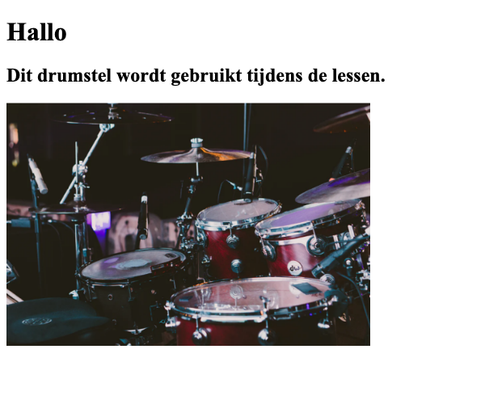
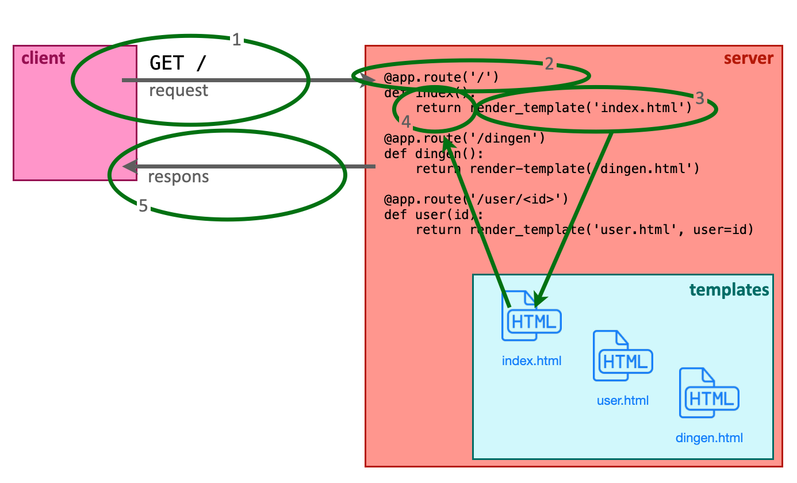
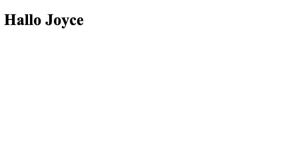
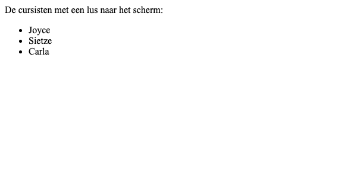
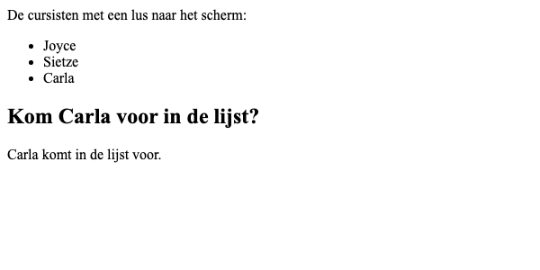

# Flask – Templates

Tot dusverre is de HTML-pagina alleen handmatig aangestuurd via een Python-string. Het ligt meer in de lijn der verwachtingen om een weergave te realiseren op basis van HTML-sjablonen. Flask zoekt automatisch naar HTML-sjablonen in de sjabloondirectory, `templates`. Later wordt nader ingegaan op de wijze hoe grotere applicaties kunnen worden gescheiden om meerdere sjabloondirectory's te hebben.

Sjablonen kunnen eenvoudig worden weergeven door de functie `render_template` uit flask te importeren en vervolgens een .html-bestand te retourneren vanuit onze view-functie.

## Tijd voor een voorbeeld

Voordat de code besproken kan worden, dient er een tweetal folders aangemaakt te worden. Zoals vermeld gaat Flask op zoek naar de map `templates`, waar de templates ondergebracht gaan worden. Die map is er nog niet. Ten tweede een folder om plaatjes in op te bergen om de sites op te leuken (deze directory noemen we `static`). De folders dienen op dezelfde hoogte in de directory te staan als de Python-files.

Voor het voorbeeld wordt er een afbeelding ‘drums.jpg’ in de folder `static` geplaatst en een HTML-file aangemaakt in de folder `templates`. De totale directory-listing ziet er dan als volgt uit:

```text
.
├── app.py
├── static
│   └── drums.jpg
└── templates
    └── basic.html
```

De template met de naam `basic.html` heeft de onderstaande inhoud. Deze code moet geen verrassing meer zijn. Deze code vormt onze eerste template.

```html
<!DOCTYPE html>
<html lang="nl">
    <head>
        <meta charset="UTF-8">
        <title>Basic</title>
    </head>
    <body>
        <h1>Hallo</h1>
        <h2>Dit drumstel wordt gebruikt tijdens de lessen.</h2>
        
    </body>
</html>
```

## Renderen van de template

We maken nu in de bovenste directory van ons project (`Flask`) een python-bestand dat deze template gaat renderen wanneer er vanuit een client een specifieke request wordt gedaan. Nu tijd om een Python-file (eerste.py) aan te maken die deze template gaat inlezen. Om dit voor elkaar te krijgen, moeten we behalve de klasse `Flask` de functie `render_template` importeren. Vervolgens maken we opnieuw een *instantie* van de klasse `Flask`.


```python
from flask import Flask, render_template
app = Flask(__name__)
```

Om de template te renderen maken we gebruik van dezelfde constructie als in de vorige paragraaf. Omdat de functies die worden gedecoreerd met een route feitelijk niets bijzonders zijn, kunnen we hierin alles doen wat we normaal ook met Python-functies kunnen doen. Dus ook de functie `render_template()` aanroepen.

```python
@app.route("/")
def index():
    return render_template("basic.html")
```



Het hele proces wordt hieronder grafisch weergegeven:



Met behulp van `render_template` is het mogelijk om direct een HTML-bestand te renderen met een Flask-webapp. Maar daarmee is de kracht van Python nog helemaal niet benut!

## Doorsturen van variabelen

Wat het eigenlijke doel is, is een manier te vinden om de Python-code uit de app aan te kunnen passen door variabelen en logica te wijzigen en bij te werken, en die verse informatie vervolgens naar de HTML-template te sturen. En dan komt de *Jinja-template engine* in beeld. Met Jinja-sjablonen is het mogelijk variabelen rechtstreeks uit de Python-code in het HTML-bestand in te voegen.


De syntax voor het invoegen van een variabele is `{{ variabele }}`. Bekijk de onderstaande template:

```html hl_lines="7"
<html lang="nl">
    <head>
        <meta charset="UTF-8">
        <title>Voorbeeld</title>
    </head>
    <body>
        <h1>Hallo {{ naam }}</h1>
    </body>
</html>
```

Om deze template te renderen, passen we in onze server de functie `cursists()` aan, en wel op zo'n manier dat de *naam* die door de route hieraan wordt meegegeven wordt doorgestuurd aan de template.

```python hl_lines="3"
@app.route("/cursist/<naam>")
def cursist(naam):
    return render_template("welkom.html", naam=naam)
```

Dit alles levert het onderstaande resultaat op:



## Andere data-typen

In het vorige voorbeeld is een simpele python-string als variabele doorgegeven aan het HTML-bestand. Uiteraard kan dat met veel meer objecten van Python zoals, lijsten (list), dictionaries en meer geregeld worden.

Het voorbeeld wordt uitgebreid door er een lijst en een dictionary aan toe te voegen. De lijst zal bestaan uit de letters van de naam 'Joyce' en de `dict` wordt een combinatie van tweede student (nummer plus naam).

De parameters kunnen vervolgens (naar keuze) ingesteld worden in de `render_template()` en daarna gebruikt worden door deze volgens de `{{ ... }}` syntax in de template in te voegen.

Nu als eerste de aanpassingen in onze server:

```python
@app.route("/demo")
def demo():
    naam ="Joyce"
    letters = list(naam)
    cur_dictionary = {"1234": "Sietse"}

    # voor de duidelijkheid zetten we hier de verschillende variabelen onder elkaar
    # dat hoeft natuurlijk niet per se...
    return render_template("voorbeeld01.html",
                            naam=naam,
                            letters=letters,
                            cur_dictionary=cur_dictionary)
```

Als we dan de template als volgt aanpassen

```html
<h1>Hallo {{ naam }}</h1>
<h1>{{ letters }}</h1>
<h1>{{ cur_dictionary }}</h1>
```

Krijgen we het onderstaande resultaat:


Deze uitkomst is één van de vele mogelijkheden om variabelen toe te voegen aan een HTML-bestand. Wanneer alleen de laatste twee letters van de naam en uitsluitend de naam van de student zichtbaar moet zijn, dient de template een wijziging te ondergaan.

```html
<h1>Hallo {{ naam }}</h1>
<h1>{{ letters[3:] }}</h1>
<h1>{{ cur_dictionary['1234'] }}</h1>
```

## Control flow

Met Jinja-sjablonen is het dus mogelijk om variabelen door te geven met behulp van de `{{ ... }}` syntax. Daarnaast kan ook gebruik gemaakt worden van de ‘control flow’ in de templates, zoals FOR-loops en IF-statements. Daarvoor is de syntax `` nodig.

Laten we het snel uitleggen met een voorbeeld.

### de `for`-lus

Stel, er is een lijstvariabele aan de HTML doorgegeven. In plaats van de hele lijst in één keer weer te geven, kan ook ieder afzonderlijk item in de Python-lijst worden weergeven als onderdeel van een met opsommingstekens. Daarvoor is de volgende syntax nodig.

```html
<ul>

    <li> {{ item }} </li>

</ul>
```

De code even kort besproken. Er wordt een ongeordende lijst (met bullets) aangemaakt die gevuld worden met items. Deze items zijn afkomstig uit een lijst (hier cursisten). Om de FOR-loop te beëindigen is het commando ‘endfor’ nodig.

Een voorbeeld. Een opsomming van een drietal cursisten. Joyce en Sietze zijn al genoemd, daar komt nu ook nog Carla bij. Onze server krijgt hiervoor een nieuwe route, `cursisten`:

```python
@app.route("/cursisten")
def cursisten():
    cursisten = ["Joyce", "Sietze", "Carla"]
    return render_template("cursisten_template.html",
                           cursisten=cursisten)
```

De template:

```html
<html>
    <head>
        <meta charset="utf-8">
        <title></title>
    </head>
    <body>
        <p>De cursisten met een lus naar het scherm:</p>
        <ul>
        
            <li>{{ cur }}</li>
        
        </ul>
    </body>
</html>
```

En dan het resultaat:



### de `if`-lus

Er zijn meerdere vormen van controle. De FOR-loop is al besproken, tijd  nu voor het IF-statement. Er wordt gecontroleerd of een opgegeven naam ook werkelijk in de lijst voorkomt.

We breiden onze eerdere template uit met de onderstaande code:

```html
<h2>Komt Carla voor in de lijst?</h2>

    <p>Carla komt in de lijst voor.</p>

    <p>Hmm, Carla komt blijkbaar niet in de lijst voor.</p>

```

Wat het volgende resultaat oplevert:




