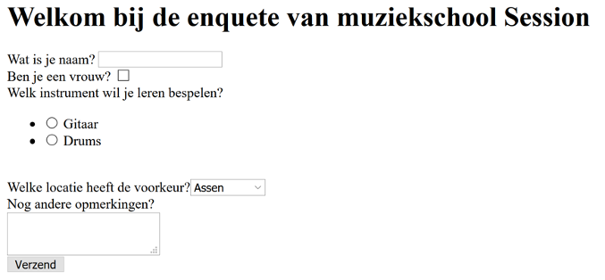
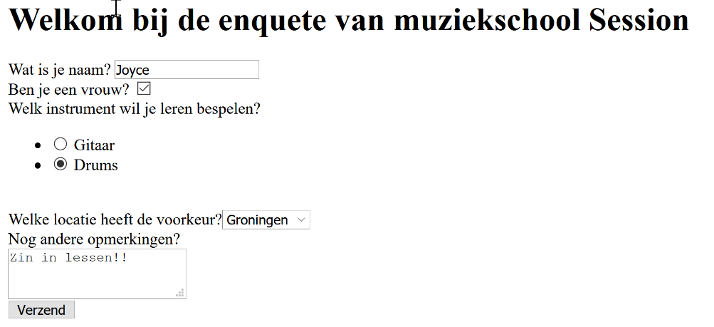
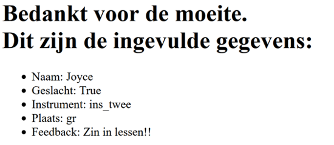

# Flask en Forms - Form Fields

## Validators
Het mooie aan het werken met formulieren is hier dat voor elk mogelijk HTML-formulierveld  een bijbehorende wtforms-klasse bestaat die geïmporteerd kan worden. wtforms heeft ook validators die op gemakkelijke wijze ingevoegd kunnen worden. Validators kunnen ingezet worden om controles uitvoeren op de formuliergegevens, zoals bijvoorbeeld een controle of een verplicht veld inderdaad een waarde gekregen heeft.

In deze paragraaf is er ook aandacht voor de wijze waarop een sessieobject van Flask ingeschakeld kan worden om de informatie in het formulier op te halen en door te geven aan een template.
In een volgende deel wordt aandacht besteed hoe de gegevens in een SQL-database opgeslagen kunnen worden.

## Voorbeeld
We gaan weer verder met een voorbeeld.
Voor het volgende uitgewerkte voorbeeld zijn drie bestanden nodig, een Python-file: `Form-Fields.py` en twee HTML-bestanden, `home1.html` en `bedankt.html`.

### Python gedeelte
Uiteraard wordt begonnen met de Python-file. Het begin is weer meer van hetzelfde, nu alleen met wat uitbreidingen.

```python
from flask import Flask, render_template, session, redirect, url_for, session
from flask_wtf import FlaskForm
from wtforms import (StringField, BooleanField, DateTimeField,
                     	          RadioField, SelectField, TextField,
                     	          TextAreaField, SubmitField)
from wtforms.validators import DataRequired

app = Flask(__name__)
app.config['SECRET_KEY'] = 'mijngeheimesleutel'
```

Er worden een aantal extra elementen geïmporteerd van Flask, die zo nader uitgelegd worden. De velden die op het formulier voor gaan komen, worden als bekend verondersteld. 


Van de validators wordt de optie DataRequired opgehaald. Er zijn er nog veel meer, bijvoorbeeld email, een optie die controleert of een ingevuld e-mailadres aan de eisen voldoet, met punt, extensie en @.


Vervolgens wordt de applicatie en de geheime sleutel gecreëerd.


### InfoForm
Volgende stap is weer het opzetten van het formulier:

```python
class InfoForm(FlaskForm):
    
    naam = StringField('Wat is je naam?',validators=[DataRequired()])
    vrouw  = BooleanField("Ben je een vrouw?")
    instrument = RadioField('Welk instrument wil je leren bespelen?', 	choices=[('ins_een','Gitaar'),('ins_twee','Drums')])
    plaats = SelectField(u'Welke locatie heeft de voorkeur?',
             choices=[('as', 'Assen'), ('dr', 'Drachten'), ('gr', 'Groningen')])
    feedback = TextAreaField()
    submit = SubmitField('Verzend')
```

Dit formulier bevat wat meer velden dan het vorige. De HTML-kennis moet voldoende zijn aangebracht om deze code te kunnen begrijpen.
De naam is een verplicht veld, en voor ieder instrument en plaats is een tuple aangemaakt. De eerste waarde wordt in de code gebruikt terwijl de tweede waarde steeds zichtbaar is op het formulier.

### View functies
Daarna is het de beurt voor de viewfuncties. Als eerste het formulier.

```python
@app.route('/', methods=['GET', 'POST'])
def index():

    form = InfoForm()
    if form.validate_on_submit():
        
        session['naam'] = form.naam.data
        session['vrouw'] = form.vrouw.data
        session['instrument'] = form.instrument.data
        session['plaats'] = form.plaats.data
        session['feedback'] = form.feedback.data

        return redirect(url_for("bedankt"))


    return render_template('home1.html', form=form)
```

Een paar opmerkingen:
Het lijkt erg veel op de code van de vorige paragraaf. Als eerste extra item wordt session gehanteerd. 

Een session-tabel is een kortstondige tijdelijke tabel waarin waarden bewaard kunnen worden om aan een andere pagina door te geven. Een mooi voorbeeld is het bestellingen van artikelen op een website. Als een artikel in een winkelmandje beland is, kan het voorkomen dat er nog een artikel aangeschaft gaat worden. Wanneer naar de pagina gesprongen wordt om het tweede artikel nog een keer uitvoerig te bekijken, wordt wanneer er geen sessievariabelen benut worden, het mandje weer geleegd. De gegevens zijn dan niet ergens opgeslagen.

Een tweede opvallend iets is dat er twee return-statements zijn aangewend. De laatste is nodig om de eerste keer een leeg formulier te tonen. 

Het andere return-statement sluist de waarden gelijk door naar de viewfunctie met de naam ‘bedankt’. De ingevoerde gegevens zullen daar getoond worden. Dit is de volgende stap.


```python
@app.route('/bedankt')
def bedankt():

    return render_template('bedankt.html')
```

### Afsluiting python code
En aan het eind het vertrouwde:

```python
if __name__ == '__main__':
    app.run(debug=True)
```

### HTML gedeelte
Nu kunnen de HTML-formulieren ingevuld worden. 
Als eerste `home1.html`:

```html
<h1>Welkom bij de enquete van muziekschool Session</h1>
<form  method="POST">
    {{ form.hidden_tag() }}
    {{ form.naam.label }} {{form.naam}}
    <br>
    {{ form.vrouw.label}} {{form.vrouw}}
    <br>
    {{form.instrument.label}}{{form.instrument}}
    <br>
    {{form.plaats.label}}{{form.plaats}}
    <br>
    Nog andere opmerkingen?
    <br>
    {{form.feedback}}
    <br>
    {{ form.submit() }}
</form>
```
Het lijkt weer veel op het de code van `home.html` uit de vorige pagina. Bovenaan een welkomsttekst, gevolgd door de openings-FORM-tag.
Binnen het formulier is als eerste de geheime sleutel opgenomen waarna de diverse velden worden geïntroduceerd, zoals in de lijst die is vastgelegd in de Python-file 
`bedankt.html`.

### bedankt.html
Als het formulier is ingevuld en er op de ‘Verzend’-knop is geklikt wordt de inhoud van de velden doorgestuurd naar `bedankt.html` en daar getoond:

```html
<h1>Bedankt voor de moeite. <br>Dit zijn de ingevulde gegevens:</h1>
<ul>
    <li>Naam: {{session['naam']}}</li>
    <li>Geslacht: {{session['geslacht']}}</li>
    <li>Instrument: {{session['instrument']}}</li>
    <li>Plaats: {{session['plaats']}}</li>
    <li>Feedback: {{session['feedback']}}</li>
</ul>
```

### Runnen van de applicatie
Tijd voor een test:


Ingevuld:



Na een klik op de button:



## Afsluiting
Een paar opmerkingen tot slot van deze paragraaf:

### Lay-out
 De lay-out kan vele malen mooier door er CSS-stijlen aan toe te voegen. 
Misschien ziet de output er wat vreemd uit, maar alles is precies volgens de opzet verlopen. Het RadioField en het SelectField zijn beide gevuld met tuples. De eerste waarde van iedere tuple wordt na selectie doorgegeven. 

In de keuzelijst kan er bijvoorbeeld gekozen worden uit de zichtbare mogelijkheden, Assen, Drachten en Groningen. De corresponderende sleutelvelden zijn as, dr en gr. Deze waarden worden doorgeven naar `bedankt.html`. Dat is met opzet gebeurd om de werking te tonen. Om de gehele plaatsnaam te tonen zou twee keer dezelfde tekenrij in de tuple moeten worden ondergebracht. 

### Validator test
Om de test op alle items te toetsen wordt nog een poging gedaan de gegevens te tonen, echter zonder een naam in te vullen. Kijken of de validator dit kan onderkennen:


En inderdaad. Een rood kader om het veld om aan te geven dat dit veld voordat het formulier verwerkt kan worden een invulling moet krijgen.