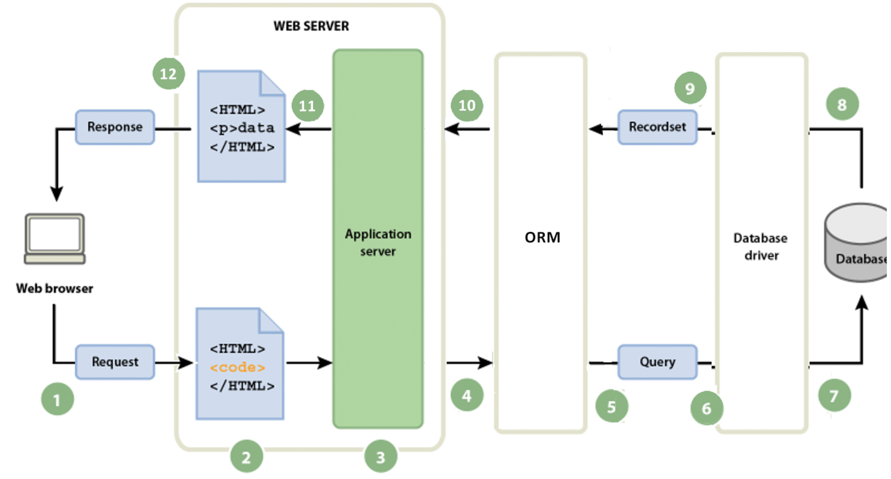

# Flask en SQL - Theorie

## Inleiding
Nu duidelijk is op welke wijze gebruikersinformatie verzameld kan worden via Forms met Flask is het tijd voor een volgende stap. Die stap is het koppelen van de Flask-applicaties aan een database, zodat de gebruikersinformatie vastgelegd kan worden.
Met behulp van SQL kunnen gegevens in een tabelvorm opgeslagen worden.

|   |Kolom 1| Kolom 2| Kolom 3
|---|---|---|---|
regel 1| | | |			
regel 2| | | |		
regel 3| | | |			

Ingevuld met een aantal cursisten van de muziekschool ziet het er als volgt uit. De eerste kolom is het sleutelveld. Deze kolom heeft als kenmerk dat de waarde slechts éénmaal mag voorkomen in de reeks. Iedere rij dient apart geselecteerd te kunnen worden.

| _id	|Voornaam|	Achternaam|	Plaats
|---|--------|------------|--------|
1|	Joyce	|Rooth	|Groningen
2	|Timo |Bijl	|Drachten
3|	Fred|	Timmer|	Assen

Zoals we weten gaat het verzamelen van gegevens uit een database of een tabel doorgaans met het commando `select`:

```sql
SELECT (één of meer velden)
FROM (naam tabel)
```

Gelukkig is het mogelijk enkele handige bibliotheken te gebruiken, waardoor de aandacht toch meer bij de Python-scripts komt te liggen.

Python en Flask kunnen verbinding maken met verschillende SQL Database-engines, waaronder PostgreSQL, MySQL, SQLite en andere. 

SQLite is een eenvoudige SQL-database-engine die bij Flask wordt geleverd en aan alle eisen voldoet. Om Python, Flask en SQL met elkaar te verbinden, is een zogenaamde Object Relational Mapper (ORM) nodig. 

Met een ORM kan Python rechtstreeks gebruik maken van de SQL-syntax om data uit eenn database op te vragen, in te voeren, te bewerken en te verwijderen. De meest voorkomende ORM voor Python is [SQL Alchemy](https://www.sqlalchemy.org/): een uitbreiding die een verbinding van Flask met SQLite mogelijk maakt.

We kunnen ons architectuurplaatje uit de eerste week nu als volgt uitbreiden:



Het kan zijn dat Flask-SQLAlchemy nog niet geïnstalleerd is. Op de gebruikelijke wijze kan dit pakket met behulp van `pip` weer toegevoegd worden voor een vlekkeloze werking van de volgende voorbeelden.


## Acties
Om op een nette wijze met databases te kunnen werken dienen de volgende acties uitgevoerd te worden:

1. Installeer een SQLite-database in een Flask-app;
2. Maak een tabel (model) aan in de Flask-app;
3. Pas de basishandelingen CRUD toe op de tabel (model)

Deze handelingen staan hieronder uitgebreid beschreven.
   
### 1. Installeer een SQLite-database in een Flask-app
Voor de eerste stap zijn de volgende acties vereist:

1. Maak een Flask-app aan op de gebruikelijke wijze.
2. Configureer de Flask-app voor SQLAlchemy.
3. Geef de applicatie door aan de SQLAlchemy-klasse-oproep.
   
Deze acties hoeven maar één keer geprogrammeerd te worden. Maar iedere keer dat er een nieuwe database moet worden opgezet, zijn dezelfde regels nodig.

### 2. Een tabel (model) aanmaken in de Flask-app
Bij de tweede stap zijn de volgende meldingen van belang:

- Modellen linken rechtstreeks naar een tabel in een SQL-database.
- Het is niet nodig om handmatig een tabel met SQL te aan maken, daarvoor wordt een Model-klasse opgevoerd in Python die de tabel genereert.
  
Het creëren van een model in Flask is vergelijkbaar met het maken van een FlaskForm. De stappen zijn:

1. Maak een modelklasse.
2. Zorg dat dit een subklasse is van `db.Model`.
3. Geef optioneel een tabelnaam op.
4. Voeg tabelkolommen toe als attributen.
5. Voeg methoden toe voor `__init__` en `__repr__`.

### 3. CRUD
Voor de volledigheid nog een keer een korte omschrijving van de basishandelingen CRUD.

operatie | Beschrijving
---|---
`CREATE` | 	Het aanmaken van bijv. database en tabellen.
`READ`   | 	Het opvragen van gegevens uit de database (`SELECT`)
`UPDATE `| 	Het wijzigen van gegevens in een tabel.
`DELETE` | 	Het verwijderen van gegevens uit een tabel.

Het volgende hoofdstuk is het aangewezen moment om over te stappen naar de concrete werkwijze van dit onderwerp.

In eerste instantie zullen de CRUD-bewerkingen nog handmatig worden uitgevoerd in een python-script. Dat is alleen gedaan om de syntax beter te kunnen begrijpen, meestal zal veel hiervan geautomatiseerd doorgevoerd worden door Flask.

 
