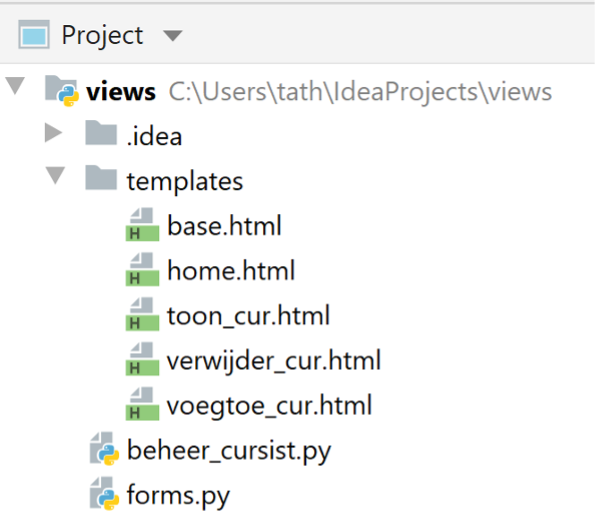
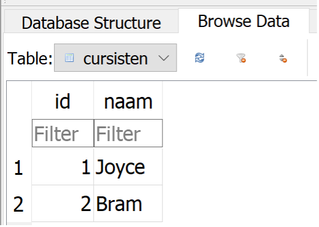
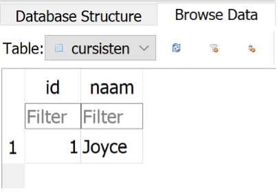

# Flask en SQL - Website

Alle inspanningen in de vorige paragrafen zijn niet voor niets geweest. Er is op dit moment  voldoende kennis en informatie aangereikt om nu eindelijk een ‘echte’ website te bouwen! Alle opgedane kennis wordt in deze paragraaf met elkaar verbonden.

De belangrijkste kenmerken die in deze paragraaf besproken zullen worden zijn:

- Het werken met templates;
- Gebruikersinformatie via formulieren ophalen;
- De aangeleverde informatie opslaan in de database;
- Overzichten maken van de opgeslagen informatie;

Dit wordt allemaal toegepast op een beheersite voor de gegevens van de cursisten met onder meer:

- Een formulier waarmee nieuwe cursisten toegevoegd kunnen worden;
- Een formulier om cursisten uit de database te verwijderen;
- De mogelijkheid tot het maken van een overzicht van alle cursisten;

Er wordt vanaf scratch begonnen om meer inzicht te krijgen in de wijze waarop een website opgebouwd wordt. Daarbij wordt een stappenplan aangehouden.

## Stap 1: Inventarisatie
Er moeten verschillende componenten geconstrueerd worden om de eerste website werkend te krijgen: 

Twee Python-files:

- [`beheer_cursist.py`](../bestanden/week6/beheer_cursist.py)
- [`forms.py`](../bestanden/week6/forms.py)
  
Een directory Templates met een vijftal HTML-bestanden:

- [`base.html`](../bestanden/week6/templates/base.html)
- [`home.html`](../bestanden/week6/templates/home.html)
- [`voegtoe_cur.html`](../bestanden/week6/templates/voegtoe_cur.html)
- [`toon_cur.html`](../bestanden/week6/templates/toon_cur.html)
- [`verwijder_cur.html`](../bestanden/week6/templates/verwijder_cur.html)
  
Het einde van stap 1 bestaat eruit alle bestanden aan te maken. Dat levert het volgende plaatje op:



## Stap 2: Begin met het opzetten van de file waarin de structuur wordt bepaald.

In dit geval is dat [`beheer_cursist.py`](../bestanden/week6/beheer_cursist.py). De eerste regels van dit bestand zijn moeten nu bekend voorkomen.
`VoegtoeForm` en `VerwijderForm` worden nog niet herkend, omdat ze pas later worden aangemaakt. 

Het werken met Forms vereist dat er een geheime sleutel moet worden ingegeven. De naam maakt niet uit, als er maar een sleutelwaarde wordt ingesteld. Het weglaten van deze regel levert een foutmelding op.

```python
import os
from forms import  VoegtoeForm, VerwijderForm
from flask import Flask, render_template, url_for, redirect
from flask_sqlalchemy import SQLAlchemy
from flask_migrate import Migrate
app = Flask(__name__)
# Omdat er formulieren gebruikt worden is een geheime sleutel nodig!
app.config['SECRET_KEY'] = 'mijngeheimesleutel'
```
Het tweede gedeelte bestaat uit het opzetten van de koppeling tussen applicatie en database:

```python
#SQL database opzet
basedir = os.path.abspath(os.path.dirname(__file__))
app.config['SQLALCHEMY_DATABASE_URI'] = 'sqlite:///' + os.path.join(basedir, 'data.sqlite')
app.config['SQLALCHEMY_TRACK_MODIFICATIONS'] = False

db = SQLAlchemy(app)
Migrate(app,db)
```

Tot dusver niets bijzonders. Het volgende gedeelte levert vast ook geen problemen op. De tabel (het model) voor de cursist wordt nu aangemaakt. Om het een klein project te laten blijven, en om de opbouw op een eenduidige wijze te kunnen beschrijven, blijft het bij een enkel model, dat ook nog eens geen relaties kent naar andere modellen:

```python
class Cursist(db.Model):

    __tablename__ = 'cursisten'
    id = db.Column(db.Integer,primary_key = True)
    naam = db.Column(db.Text)

    def __init__(self,naam):
        self.naam = naam

    def __repr__(self):
        return f"Naam van de cursist: {self.naam}"
```

## Stap 3: Aanmaken van de views-functies met de formulieren.

Voor het gemak zijn de Engelse termen aangehouden zoals *add*, *delete* en *list*.

### index

```python
@app.route('/')
def index():
    return render_template('home.html')
```

Wanneer de index wordt opgevraagd wordt er doorgeschakeld naar de pagina [`home.html`](../bestanden/week6/templates/home.html).

### add

```python
@app.route('/add', methods=['GET', 'POST'])
def add_cur():
    form = VoegtoeForm()

    if form.validate_on_submit():
        naam = form.naam.data

        # Voeg een nieuwe cursist toe aan de database
        new_cur = Cursist(naam)
        db.session.add(new_cur)
        db.session.commit()

        return redirect(url_for('toon_cur'))

    return render_template('voegtoe_cur.html',form=form)
```

Op het moment dat deze view wordt aangeroepen wordt er doorgeschakeld naar [`voegtoe_cur.html`](../bestanden/week6/templates/voegtoe_cur.html). Daar wordt een leeg formulier getoond met een passende tekst. Als de naam van een nieuwe cursist is ingevuld en bevestigd, wordt [`toon_cur.html`](../bestanden/week6/templates/toon_cur.html) geopend en verschijnt de lijst met alle aanwezige cursisten in beeld. In dit voorbeeld zal deze lijst zeer beperkt blijven.

### list

```python
@app.route('/list')
def list_cur():
    # Maak een lijst van alle aanwezige cursisten in de database.
    cursisten = Cursist.query.all()
    return render_template('toon_cur.html', cursisten=cursisten)
```

In deze view wordt een lijst aangemaakt van alle cursisten en die lijst wordt doorgegeven naar [`toon_cur.html`](../bestanden/week6/templates/toon_cur.html), die de deelnemers laat zien.

### delete

```python
@app.route('/delete', methods=['GET', 'POST'])
def del_cur():
    form = VerwijderForm()

    if form.validate_on_submit():
        id = form.id.data
        cur = Cursist.query.get(id)
        db.session.delete(cur)
        db.session.commit()

        return redirect(url_for('toon_cur'))
    return render_template('verwijder_cur.html',form=form)
```

Weer meer van hetzelfde. Als het de bedoeling is een cursist te verwijderen dan wordt deze view opgestart. Omdat er nog niet op een button geklikt is, wordt gelinkt naar [`verwijder_cur.html`](../bestanden/week6/templates/verwijder_cur.html) en zal er een leeg scherm te zien zijn met weer een passende tekst. Na invulling van het id van de cursist en een bevestiging daarvan door op de knop te drukken, zal het record verwijderd worden waarna [`toon_cur.html`](../bestanden/week6/templates/toon_cur.html) aangeroepen wordt waardoor de aangepast lijst zichtbaar is.

Ter afsluiting:

```python
if __name__ == '__main__':
    app.run(debug=True)
```

## Stap 4: Het ontwerpen van de formulieren 

Hier worden de formulieren in [`forms.py`](../bestanden/week6/forms.py) ontworpen.
Er is al uitvoerig aandacht besteed aan het opzetten van formulieren met `Flask`. Ook deze twee formulieren `VoegtoeForm` en `VerwijderForm` zullen vast geen vragen meer oproepen:

```python
from flask_wtf import FlaskForm
from wtforms import StringField, IntegerField, SubmitField

class VoegtoeForm(FlaskForm):

    naam = StringField('Vul de naam van de nieuwe cursist in:')
    submit = SubmitField('Voeg toe')

class VerwijderForm(FlaskForm):

    id = IntegerField('Vul het ID van de cursist die verwijderd gaat worden in:')
    submit = SubmitField('Verwijder')
```

Het formulier om een cursist toe te voegen kent een veld waarin een naam kan worden ingegeven en een knop om te bevestigen. Voor het verwijderen van een cursist is een veld nodig om het `id` in te geven en weer een knop om te bevestigen.

## Stap 5: Het vullen van de HTML-bestanden.

### `base.html`
In dit bestand wordt de structuur van de website grotendeels vastgelegd. In ieder geval wordt de connectie naar Bootstrap hier vastgelegd en wordt er ook een navigatiebalk opgemaakt. Het is de bedoeling dat alle overige webpagina’s van dit sjabloon gebruik gaan maken. Die pagina’s kunnen hun eigen specifieke inhoud opnemen in het block-vak.

```html
<!DOCTYPE html>
<html lang="en" dir="ltr">
<head>
    <meta charset="utf-8">
    <link rel="stylesheet" href="https://maxcdn.bootstrapcdn.com/bootstrap/4.0.0/css/bootstrap.min.css" 	integrity="sha384-	Gn5384xqQ1aoWXA+058RXPxPg6fy4IWvTNh0E263XmFcJlSAwiGgFAW/dAiS6JXm" 	crossorigin="anonymous">
    <script src="https://code.jquery.com/jquery-3.2.1.slim.min.js" integrity="sha384-	KJ3o2DKtIkvYIK3UENzmM7KCkRr/rE9/Qpg6aAZGJwFDMVNA/GpGFF93hXpG5KkN" 	crossorigin="anonymous"></script>
    <script src="https://cdnjs.cloudflare.com/ajax/libs/popper.js/1.12.9/umd/popper.min.js" 	integrity="sha384-	ApNbgh9B+Y1QKtv3Rn7W3mgPxhU9K/ScQsAP7hUibX39j7fakFPskvXusvfa0b4Q" 	crossorigin="anonymous"></script>
    <script src="https://maxcdn.bootstrapcdn.com/bootstrap/4.0.0/js/bootstrap.min.js" 	integrity="sha384-	JZR6Spejh4U02d8jOt6vLEHfe/JQGiRRSQQxSfFWpi1MquVdAyjUar5+76PVCmYl" 	crossorigin="anonymous"></script>

    <title>Beheer cursisten</title>
</head>
<body>

<nav class="navbar navbar-expand-lg navbar-light bg-light">
    <div class="navbar-nav">
        <a class="nav-item nav-link" href="{{ url_for('index') }}">Home</a>
        <a class="nav-item nav-link" href="{{ url_for('add_cur') }}">Voeg cursist toe</a>
        <a class="nav-item nav-link" href="{{ url_for('list_cur') }}">Toon cursisten</a>
        <a class="nav-item nav-link" href="{{ url_for('del_cur') }}">Verwijder cursist</a>
    </div>
</nav>




</body>
</html>
```

Als eerste dus de gekopieerde linken, vervolgens de navigatiebalk en tenslotte de plek waar ruimte is voor de andere pagina’s om hun inhoud te tonen.

### `home.html`

Een heel eenvoudige pagina om mee te starten:

```html


<div class="jumbotron">
    <h1>Welkom bij de beheersite van onze cursisten</h1>
    <p>Om te beginnen, selecteer een item uit de navigatiebalk.</p>
</div>

```

De code van `base.html` wordt als eerste ingeladen. In het block worden de inleidende teksten vermeld en er is als accent gekozen om het ‘`jumbotron`’-effect te selecteren.

### `voegtoe_cur.html`

```html


<div class="jumbotron">
    <h1>Heeft zich een nieuwe cursist aangemeld?</h1>
    <p>Vul de naam in en klik op Voeg toe:</p>
    <form method="POST">
        {{ form.hidden_tag() }}
        {{ form.naam.label }} {{ form.naam() }}
        {{ form.submit() }}
    </form>
</div>

```

Niets nieuws onder de zon. Alleen hier nog even aandacht voor de geheime tag die moet worden opgenomen wanneer er met een formulier wordt gewerkt.

### `toon_cur.html`

```html


<div class="jumbotron">
    <h1>Dit zijn de momenteel ingeschreven cursisten.</h1>
    <ul>
        
        <li>{{cur}}</li>
        
    </ul>
</div>

```

Een koptekst plus een lijst met cursisten. De `FOR`-loop haalt de cursisten één voor éen op uit de tabel cursisten.

### `verwijder_cur.html`

```html


<div class="jumbotron">
    <h1>Afmelding binnen gekomen?</h1>
    <p>Vul het ID van de cursist in en klik op Verwijder.</p>
    <form method="POST">
        {{ form.hidden_tag() }}
        {{ form.id.label }} {{ form.id() }}
        {{ form.submit() }}
    </form>
</div>

```

Ook hier weer de geheime controletag omdat het een formulier betreft.

## Stap 6: Migreren
Voordat er getest kan worden moet het migratiepad nogmaals worden aangebracht. Dat moet hier gebeuren omdat er een nieuw project is opgestart.

De stappen:

- Stel de omgevingsvariabele FLASK_APP in
    - Voor een MacOS / Linux-machine is dat export FLASK_APP = beheer_cursist.py
    - Voor een Windows-machine set FLASK_APP = beheer_cursist.py
- flask db init  
- flask db migrate -m "zomaar eenbericht"  
- flask db upgrade 

## Stap 7: Testen

Eerste test is het runnen van `beheer_cursist.py`:


Tabel `Cursist` bestaat nu ook:


Nu ‘Voeg cursist toe’:


Joyce is de eerste:


Na een klik op ‘Voeg toe’:


Vervolgens is Bram aan de beurt:


Na een klik op ‘voeg toe’:


Bram mag weer uit de Tabel verwijderd worden, zijn ID = 2, kan opgezocht worden:




Na een klik op ‘Verwijder’:


Terug naar Home:


Als laatste nog een blik op de database:



Inderdaad nog maar één cursist aanwezig.
