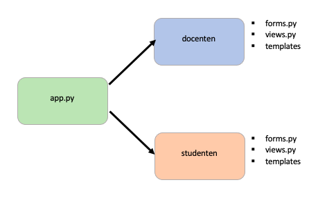

# Flask-applicaties - Structuur

## Refactoring

Tot nu toe zijn alle coderegels in één `app.py`-bestand ondergebracht. Voor grotere Flask-applicaties is het logischer om delen van de applicatie in hun eigen bestanden vast te leggen bijvoorbeeld in `models.py`, `forms.py` en `views.py`.

Voor nog grotere toepassingen begint het logisch te worden om de bestanden te herstructureren en componenten te scheiden zoals forms, views en templates voor elke belangrijke component.

Bij de vorige oefening waren alle formulieren, views en templates in een enkel bestand of directory opgenomen. In dit deel hebben we aandacht voor de wijze waarop de ontwikkelde applicatie van [oefening 1](../week6/oefeningen/flask-views-oefening1.md) *gerefactored* kan worden.

Refactoren is een andere structuur aan code (of eigenlijk een hele *code-base*) geven. Daarvoor wordt de file [`mentor_site.py`](../bestanden/mentor_site.py) opgesplitst in afzonderlijke componenten voor de hierboven genoemde aspecten. In plaats van `mentor_site.py` wordt vanaf nu `app.py ` gehanteerd.



!!! Tip "Gebruik een bibliotheek"
    De [`blueprints`]()-bibliotheek kan gebruikt worden om deze afzonderlijke modulaire componenten te verbinden met het hoofdbestand `app.py`.

Houd er rekening mee dat de `app.py` nog steeds een rol speelt, alleen verwijst het nu alleen nog naar de subcomponenten in plaats van zelf alle code te bevatten.

## Nieuwe structuur

Tijd om de definitieve structuur aan te brengen voor deze applicatie!

Het is een best lang overzicht:

- `app.py`	(main `app.py`-bestand dat moet worden aangeroepen om de server voor de webapp te starten)
- `requirements.txt` (Bestand waarin de *dependencies* zijn opgeslagen)
- migrations (folder waarin de migraties zijn ondergebracht)
- mijn_project (project map, sub-componenten in aparte mappen)
    - `data.sqlite`
    - `models.py`
    - `__init__.py`
    - docenten
        - `forms.py`
        - `views.py`
        - templates
            - docenten
                - `add.html`
                - `delete.html`
                - `list.html`
    - studenten
        - `forms.py`
        - `views.py`
        - templates
            - studenten
                - `add.html`
    - static (voor de opslag van CSS, JS, afbeeldingen, lettertypen etc.)
    - templates
        - `base.html`
        - `home.html`


!!! info "requirements.txt"
    In Python projecten zal je vaak een `requirements.txt` bestand zien dit is een bestand waar de afhankelijkheden (de gebruikte modules) van de applicatie zijn beschreven. Je kan met `pip` de geïnstalleerde modules als volgt naar dit bestand laten schrijven:

    ```console
    pip freeze > requirements.txt
    ```

    Als je vervolgens de inhoud van `requirements.txt` bekijkt zal je zien dat het modules bevat inclusief versienummer, bijvoorbeeld `Flask==1.1.2`. Dit bestand wordt ook gebruikt om in bijvoorbeeld een nieuwe virtuele omgeving de vereiste modules te installeren, bijvoorbeeld:

    ```console
    pip install -r requirements.txt
    ```

    Het vastzetten van modules en bijbehorende versienummers is een manier om een repliceerbare omgeving voor een applicatie te gegaranderen, bijvoorbeeld als het live op een server moet draaien of zelfs als jij met andere mensen gaat samenwerken aan een project.

In de volgende paragraaf wordt een applicatie omgeschreven naar een meer overzichtelijke vorm. Als voorbeeld gebruiken we de applicatie van de oefening uit het deel waarin voor het eerst een website gebouwd is.