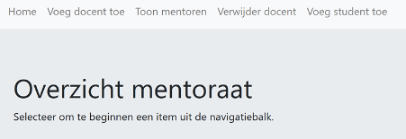
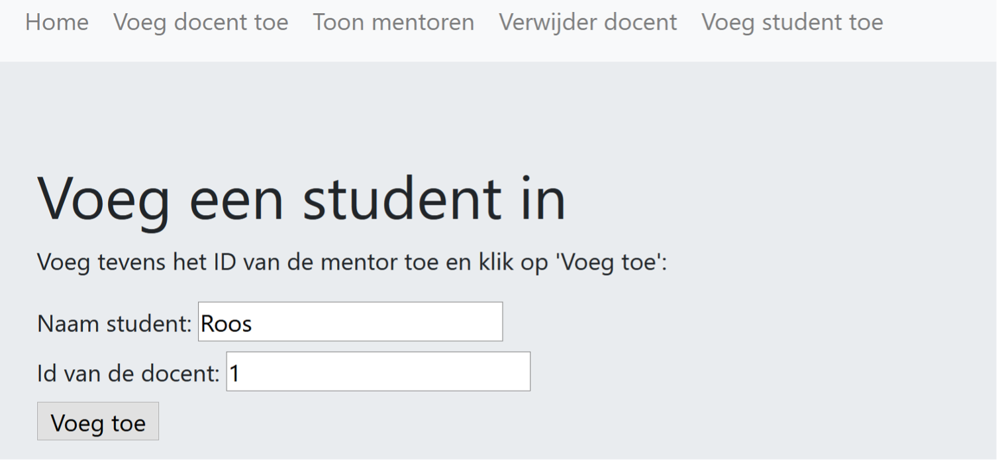

# Flask-applicaties - Blueprints

Tot dusver hebben is de inhoud van de bestanden niet gewijzigd. We hebben ze uit elkaar gehaald en opgenomen in afzonderlijke folders, maar verder niet aangepast. Voor de `views.py`-bestanden moeten deze bestanden als blueprints toegevoegd worden om daarna geregistreerd te kunnen worden in het bestand  `__init__.py`.

Er zijn nog een aantal aandachtspunten van de vorige paragraaf blijven hangen waar ook nog een passende oplossing voor gecreëerd dient te worden:

- Het toevoegen van code aan de `views.py`-bestanden.
- Het toevoegen van de blueprints.
- Het registreren van de blueprints.
- Het coderen van de file `app.py`.
- Aanpassen van de `url_for ()`-links in de navigatiebalk.
- Het aanmaken van de database.
- Als laatste weer het testen of de applicatie minstens zo goed werkt als de vorige versie.

## De studenten-view

De belangrijkste reden om blueprints te gebruiken is dat we hiermee onnze applicatie kunnen organiseren door logica in submappen te groeperen.

`views.py` (uit de folder `mijnproject/studenten/views.py`):

```python hl_lines="1 6-8"
from flask import Blueprint,render_template,redirect,url_for
from mijnproject import db
from mijnproject.models import Student
from mijnproject.studenten.forms import AddForm

studenten_blueprint = Blueprint('studenten',
                             __name__,
                             template_folder='templates')

@studenten_blueprint.route('/add', methods=['GET', 'POST'])
def add():

    form = AddForm()

    if form.validate_on_submit():
        naam = form.naam.data
        doc_id = form.doc_id.data
        new_student = Student(naam,doc_id)
        db.session.add(new_student)
        db.session.commit()

        return redirect(url_for('docenten.list'))
    return render_template('studenten/add.html',form=form)
```

Als eerste wordt hier weer het nodige geïmporteerd. Belangrijk hierbij is dat ook `Blueprint` wordt meegenomen uit het pakket `flask`. Verder zijn nodig de database (db) uit `mijnproject`, de tabel `Student` en het formulier waarmee een nieuwe student ingevoerd kan worden. 

Vervolgens wordt er een variabele aangemaakt `studenten_blueprint`. Deze variabele is een instantie van de klasse `Blueprint`. Er moeten een drietal kenmerken worden vastgelegd: een naam (hier `studenten`), de naam van de applicatie, en de folder die verantwoordelijk is voor alle logica voor de studenten. 

Daarna kan de decorator aangemaakt worden. Dit moet weer bekend voorkomen. Aangezien alle gegevens van studenten zijn samengebracht in de map `studenten` valt af te lezen dat het pad om de gegevens terug te kunnen vinden binnen `templates/` heel logisch wordt. Dat pad wordt ook vastgelegd in `studenten_blueprint`. Voor het pad binnen render-templates voegen we dan nog de directory toe waar het te gebruiken template staat `studenten/add.html`.

Vervolgens wordt de view gecodeerd (gekopieerd). Daarbij wordt als eerste het formulier gedefinieerd en vervolgens bepaalt wat er moet gebeuren als er nog niet op *Submit* geklikt is en wat wanneer het formulier al wel is ingevuld.

## De docenten-view

`views.py` (uit de folder `mijnproject/docenten/views.py`)

```python
from flask import Blueprint,render_template,redirect,url_for
from mijnproject import db
from mijnproject.docenten.forms import AddForm,DelForm
from mijnproject.models import Docent

docenten_blueprint = Blueprint('docenten',
                              __name__,
                              template_folder='templates')

@docenten_blueprint.route('/add', methods=['GET', 'POST'])
def add():
    form = AddForm()

    if form.validate_on_submit():
        naam = form.naam.data

        new_doc = Docent(naam)
        db.session.add(new_doc)
        db.session.commit()

        return redirect(url_for('docenten.list'))

    return render_template('docenten/add.html',form=form)

@docenten_blueprint.route('/list')
def list():
    docenten = Docent.query.all()
    return render_template('docenten/list.html', docenten=docenten)

@docenten_blueprint.route('/delete', methods=['GET', 'POST'])
def delete():

    form = DelForm()

    if form.validate_on_submit():
        id = form.id.data
        doc = Docent.query.get(id)
        db.session.delete(doc)
        db.session.commit()

        return redirect(url_for('docenten.list'))
    return render_template('docenten/delete.html',form=form)
```

Meer van hetzelfde. Nu zijn er twee views die gemaakt moeten worden. De `blueprint` verwijst nu naar de folder waar de applicatie-onderdelen voor docenten gevonden kunnen worden.

## Registratie van de blueprints

De blueprints moeten nu nog geregistreerd worden in de file `__init__.py`. De blueprints moeten worden opgenomen in de code *nadat* de db gedefinieerd is.

Dat vastleggen gaat in een tweetal stappen. Als eerste moeten de blueprints opgehaald worden uit de folders waar ze zijn aangemaakt. Eenmaal geïmporteerd kunnen ze geregistreerd worden:

```python
from mijnproject.docenten.views import docenten_blueprint
from mijnproject.studenten.views import studenten_blueprint

app.register_blueprint(studenten_blueprint,url_prefix="/studenten")
app.register_blueprint(docenten_blueprint,url_prefix='/docenten')
```

De laatste file die nog geen inhoud heeft is `app.py`. Daarin wordt de volgende code ondergebracht:

```python
from mijnproject import app
from flask import render_template

@app.route('/')
def index():
    return render_template('home.html')

if __name__ == '__main__':
    app.run(debug=True)
```

Om te beginnen worden er weer een tweetal items ingeladen. Op het eerste gezicht ziet `import app` er wat raar uit, maar er wordt gevraagd om de volgende regel: `app = Flask(__name__)` op te halen uit `__init__.py`. Belangrijk is dat vervolgens de homepagina geladen kan worden als aan de `if`-voorwaarde voldaan wordt.

## Laatste loodjes

Er staan nog drie punten op het lijstje die nog gedaan moeten worden:

- Aanpassen van de `url_for ()`-links in de navigatiebalk.

- Het aanmaken van de database.

- het testen.

Het bestand `base.html` moet nog aangepast worden omdat de hyperlinks nu nog naar pagina’s verwijzen die niet meer bestaan. De aanpassingen staan hieronder vermeld, de links naar Bootstrap zijn weggelaten:

```html hl_lines="5-8"
<nav class="navbar navbar-expand-lg navbar-light bg-light">

    <div class="navbar-nav">
        <a class="nav-item nav-link" href="{{ url_for('index') }}">Home</a>
        <a class="nav-item nav-link" href="{{ url_for('docenten.add') }}">Voeg docent toe</a>
        <a class="nav-item nav-link" href="{{ url_for('docenten.list') }}"> Toon mentoren</a>
        <a class="nav-item nav-link" href="{{ url_for('docenten.delete') }}">Verwijder docent</a>
        <a class="nav-item nav-link" href="{{ url_for('studenten.add') }}">Voeg student toe</a>
    </div>

</nav>
```

Voordat er getest kan worden dient de database aangemaakt te worden. Daarvoor zijn de vier inmiddels bekende stappen nodig:

1. Stel de omgevingsvariabele FLASK_APP in
    - Voor een MacOS / Linux-machine is dat `export FLASK_APP = app.py`
    - Voor een Windows-machine `set FLASK_APP = app.py`
2. `flask db init ` 

## Resultaat

Als alles naar behoren is gegaan kan er nu weer getest worden. 

Homepagina:



Na het toevoegen van docent Bart:


Docent Bart wordt mentor van Roos:




