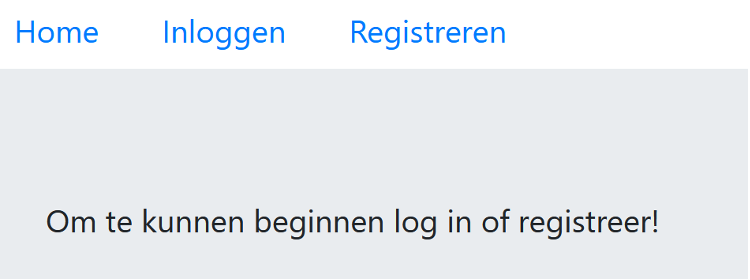
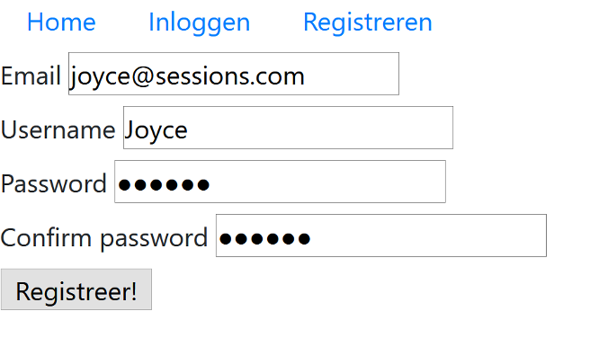
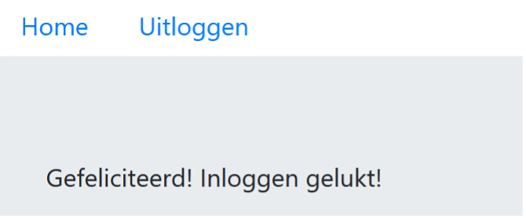
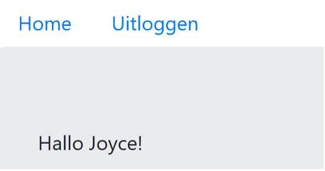

# User authentication - Flask_login deel III

Het meeste werk is achter de rug. Alleen de HTML-bestanden uit de folder `templates` blijven nog over. Er zijn nog een aantal acties waar uitleg bij nodig is maar het merendeel zou geen problemen meer moeten opleveren.

## `base.html`

Dit bestand wordt altijd gebruikt om een aantal standaardwaarden in op te nemen die vervolgens doorgegeven kunnen worden aan de andere files uit de folder `templates`:

```html
<!DOCTYPE html>
<html>
  <head>
    <link rel="stylesheet" href="https://maxcdn.bootstrapcdn.com/bootstrap/4.0.0/css/bootstrap.min.css" integrity="sha384-Gn5384xqQ1aoWXA+058RXPxPg6fy4IWvTNh0E263XmFcJlSAwiGgFAW/dAiS6JXm" crossorigin="anonymous">
    <script src="https://code.jquery.com/jquery-3.2.1.slim.min.js" integrity="sha384-KJ3o2DKtIkvYIK3UENzmM7KCkRr/rE9/Qpg6aAZGJwFDMVNA/GpGFF93hXpG5KkN" crossorigin="anonymous"></script>
    <script src="https://cdnjs.cloudflare.com/ajax/libs/popper.js/1.12.9/umd/popper.min.js" integrity="sha384-ApNbgh9B+Y1QKtv3Rn7W3mgPxhU9K/ScQsAP7hUibX39j7fakFPskvXusvfa0b4Q" crossorigin="anonymous"></script>
    <script src="https://maxcdn.bootstrapcdn.com/bootstrap/4.0.0/js/bootstrap.min.js" integrity="sha384-JZR6Spejh4U02d8jOt6vLEHfe/JQGiRRSQQxSfFWpi1MquVdAyjUar5+76PVCmYl" crossorigin="anonymous"></script>
    <meta charset="utf-8">
    <title></title>
  </head>
```

Dit gedeelte is bekend en in de code zijn de benodigde linken naar Bootstrap opgenomen.

De body vereist een kleine uitleg:

```html hl_lines="7 9 12"
 <body>
  <ul class="nav">

  <li class="nav-item">
    <a class="nav-link" href="{{ url_for('home') }}">Home</a>
  </li>
    
    <li class="nav-link"><a href="{{ url_for('logout') }}">Uitloggen</a></li>
    
    <li class="nav-link"><a href="{{ url_for('login') }}">Inloggen</a></li>
    <li class="nav-link"><a href="{{ url_for('register') }}">Registreren</a></li>
    

</ul>




  </body>
</html>
```

De inhoud van de navigatiebalk, het menu wat de gebruiker te zien krijgt, wordt bepaald door de voorwaarde `if current_user.is_authenticated`. 

Is de gebruiker door de selectie gekomen dan heeft hij de mogelijkheid te kunnen uitloggen, en zo niet, dan kan een gebruiker zich laten registreren of inloggen.

## `home.html`

```html
% extends "base.html" %}

<div class="jumbotron">
  
    <p>Hallo {{ current_user.username }}!</p>
  
    <p>Om te kunnen beginnen: log in of registreer!</p>
  
</div>


```

Als de homepagina wordt aangeroepen door een ingelogde gebruiker verschijnt de tekst ‘Hallo‘ + de naam. Is de gebruiker niet ingelogd, dan verschijnt er een aansporing om in te loggen of te registreren.

## `welkom.html`

```html


<div class="jumbotron">
    <p>Gefeliciteerd! Inloggen gelukt!</p>
</div>

```

## `register.html`

```html


<form method="POST">
    {{ form.hidden_tag() }}
    {{ form.email.label }} {{ form.email() }}<br>
    {{ form.username.label }} {{ form.username() }}<br>
    {{ form.password.label }} {{ form.password() }}<br>
    {{ form.pass_confirm.label }} {{ form.pass_confirm() }}<br>
    {{ form.submit() }}
</form>

```

Wanneer de view `register` wordt opgeroepen, wordt het registratieformulier getoond. Ook wordt er gecontroleerd op een typo bij het invullen van het wachtwoord.

## `login.html`

```html


<form method="POST">
    {{ form.hidden_tag() }}
    {{ form.email.label }} {{ form.email() }}
    {{ form.password.label }} {{ form.password() }}
    {{ form.submit() }}
</form>

```

Ook hier is een formulier nodig om een gebruiker toestemming te verlenen de pagina’s van de site te kunnen inspecteren.

## Testen

Tot zover alle code die nodig is om een inlogsysteem op te zetten. Nu komt weer het spannendste deel, het testen.

Na het runnen van `app.py`:



Registreren ('joyce@sessions.com' en het wachtwoord 'geheim'):



Inloggen:


Na inloggen:


Een klik op Home:



Tot zover het testen. Er kunnen nog veel meer opties bekeken worden op hun gedrag, maar voor nu is dit even voldoende.


